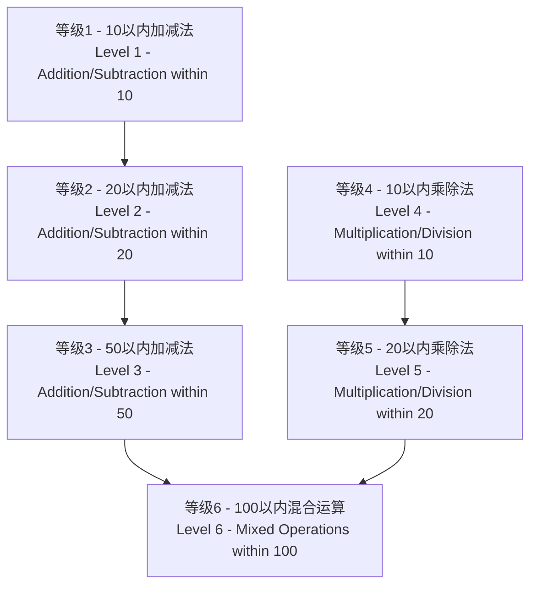

<div align="center">

# 🧮 小学生算术学习应用
## Elementary Arithmetic Learning App

*Version: 1.0.1* | *Updated: January 5, 2026*

[](https://github.com/tobecrazy/Arithmetic)

[](https://developer.apple.com/ios/)
[](https://swift.org/)
[](https://developer.apple.com/xcode/swiftui/)
[](LICENSE)

*一个使用SwiftUI开发的智能算术学习应用，帮助小学生掌握基础四则运算*

*An intelligent arithmetic learning application built with SwiftUI to help elementary students master basic mathematical operations*

[🚀 快速开始](#-快速开始-quick-start) • [✨ 功能特点](#-功能特点-features) • [📥 安装说明](#-安装说明-installation) • [🏗️ 技术实现](#️-技术实现-technical-implementation) • [📊 系统信息监控](#️-系统信息监控-system-information-monitoring) • [🔄 更新日志](#-最近更新-recent-updates)

</div>

---

## 📋 目录 (Table of Contents)

- [✨ 功能特点 (Features)](#-功能特点-features)
- [🚀 快速开始 (Quick Start)](#-快速开始-quick-start)
- [🎯 难度等级系统 (Difficulty Levels)](#-难度等级系统-difficulty-levels)
- [⚙️ 系统要求 (Requirements)](#️-系统要求-requirements)
- [📥 安装说明 (Installation)](#-安装说明-installation)
- [📖 使用说明 (Usage)](#-使用说明-usage)
- [🏗️ 技术实现 (Technical Implementation)](#️-技术实现-technical-implementation)
- [📊 系统信息监控 (System Information Monitoring)](#️-系统信息监控-system-information-monitoring)
- [📁 项目结构 (Project Structure)](#-项目结构-project-structure)
- [🔄 最近更新 (Recent Updates)](#-最近更新-recent-updates)
- [🤝 贡献指南 (Contributing)](#-贡献指南-contributing)
- [📄 许可证 (License)](#-许可证-license)

---

## ✨ 功能特点 (Features)

<div align="center">

| 🎯 核心功能 | 🧠 智能系统 | 🌐 用户体验 |
|------------|------------|------------|
| 6级难度体系 | 错题收集分析 | 中英文双语 |
| 四则运算练习 | 8种解题方法 | 设备自适应 |
| 实时计分系统 | 进度自动保存 | 响应式设计 |
| TTS语音朗读 | 九九乘法表 | 深色模式支持 |
| PDF题库生成 | 系统信息监控 | 设置选项 |
| 欢迎引导流程 | 数学公式大全 | QR码扫描工具 |
| 网络状态检测 | 单位换算 | 电池监控 |
| Firebase崩溃监控 (Firebase Crash Monitoring) | 运行时长计算 | 关于页面 (About Page) |
| Git信息嵌入 (Git Info Embedding) | | |

</div>

### 🔍 错题收集系统 (Wrong Questions Collection System)
- **智能收集 (Intelligent Collection)** - 自动收集用户答错的题目 (Automatically collects user's wrong answers)
- **多入口访问 (Multiple Access Points)** - 从主页面和结果页面均可访问错题集 (Accessible from both main page and result page)
- **分类管理 (Categorized Management)** - 按难度等级分类错题 (Categorizes wrong questions by difficulty level)
- **统计分析 (Statistical Analysis)** - 显示错题统计信息（展示次数、错误次数） (Shows statistics like display count, error count)
- **灵活删除 (Flexible Deletion)** - 支持删除单个错题、所有错题或已掌握的错题 (Supports deleting individual, all, or mastered wrong questions)
- **智能识别 (Smart Recognition)** - 自动识别已掌握的错题（正确率达到70%以上） (Automatically identifies mastered questions with 70%+ accuracy)
- **优先练习 (Priority Practice)** - 错题集中的题目会在后续练习中优先出现，帮助巩固薄弱点 (Questions appear with priority in subsequent practice to help consolidate weak points)

### 📚 数学题库生成 (Math Bank PDF Generation)
- **📄 PDF生成 (PDF Generation)** - 生成可打印的数学题库PDF文件，支持题目页和答案页分离 (Generates printable math problem bank PDF files with separate question and answer pages)
- **⚙️ 自定义设置 (Custom Settings)** - 用户可选择难度等级和题目数量，支持10-100题范围配置 (Users can select difficulty level and number of questions, supporting 10-100 question range configuration)
- **🔄 错题优先 (Wrong Questions Priority)** - 优先选用错题集中的题目，帮助巩固薄弱点 (Prioritizes questions from the wrong question collection to help consolidate weak points)
- **📋 答案页面 (Answer Pages)** - 生成包含题目和答案的完整PDF，便于自我检测和评分 (Generates complete PDF with both question and answer pages for self-assessment)
- **📤 分享选项 (Sharing Options)** - 支持保存到文件、文档目录或通过系统分享功能分享 (Supports saving to files, document directory, or sharing via system share functionality)
- **🖨️ 打印友好 (Print-Friendly)** - A4格式优化布局，确保打印效果清晰 (A4 format optimized layout to ensure clear printing results)
- **🌐 双语支持 (Bilingual Support)** - 生成的PDF支持中英文双语，适应不同语言环境 (Generated PDFs support bilingual Chinese/English for different language environments)
- **💾 本地存储 (Local Storage)** - 题库PDF自动保存至应用文档目录，方便随时访问 (Problem bank PDFs automatically saved to app document directory for easy access)


### 🎯 智能解题方法 (Intelligent Solution Methods)
- **加法方法 (Addition Method)** - 凑十法 (Making Ten Method)
- **减法方法 (Subtraction Methods)** - 破十法 (Breaking Ten Method), 借十法 (Borrowing Ten Method), 平十法 (Leveling Ten Method)
- **乘法方法 (Multiplication Methods)** - 乘法口诀法 (Multiplication Table Method), 分解乘法 (Decomposition Multiplication)
- **除法方法 (Division Methods)** - 除法验算法 (Division Verification), 分组除法 (Grouping Division)
- **智能选择 (Smart Selection)** - 系统自动选择最适合的解题方法进行解析 (System automatically selects the most suitable solution method for analysis)

### 🔢 九九乘法表 (9×9 Multiplication Table)
- **完整乘法表 (Complete Multiplication Table)** - 展示1×1到9×9的完整乘法运算表 (Shows complete multiplication table from 1×1 to 9×9)
- **颜色分级 (Color Grading)** - 不同颜色标识不同难度级别，便于学习识别 (Different colors indicate difficulty levels for easier learning recognition)
  - 🔵 蓝色：相同数字相乘（1×1, 2×2等） (Blue: Same number multiplication (1×1, 2×2, etc.))
  - 🟢 绿色：结果≤10的简单运算 (Green: Simple operations with results ≤10)
  - 🟠 橙色：结果11-50的中等运算 (Orange: Medium operations with results 11-50)
  - 🔴 红色：结果>50的挑战运算 (Red: Challenging operations with results >50)
- **响应式布局 (Responsive Layout)** - 根据设备类型自动调整网格列数 (Automatically adjusts grid columns based on device type)
  - iPad横屏：9列完整显示 (iPad Landscape: 9 columns for full display)
  - iPad竖屏：6列优化阅读 (iPad Portrait: 6 columns for optimized reading)
  - iPhone横屏：6列适配 (iPhone Landscape: 6 columns for adaptation)
  - iPhone竖屏：3列紧凑显示 (iPhone Portrait: 3 columns for compact display)
- **双向滚动 (Bidirectional Scrolling)** - 支持垂直和水平滚动，确保所有内容可访问 (Supports vertical and horizontal scrolling to ensure all content is accessible)
- **学习辅助 (Learning Aid)** - 作为乘法练习的参考工具，帮助学生记忆乘法口诀 (As a reference tool for multiplication practice, helps students memorize multiplication tables)

### 🔊 九九乘法表双语发音 (Bilingual TTS for Multiplication Table)
- **真人发音 (Human-like Pronunciation)** - 集成iOS原生TTS引擎，提供清晰的真人发音 (Integrated with the native iOS TTS engine for clear, human-like speech)
- **双语支持 (Bilingual Support)** - 支持中英文双语发音，用户可以根据系统语言或应用内设置切换 (Supports both Chinese and English pronunciation, which can be switched based on system language or in-app settings)
- **即时反馈 (Instant Feedback)** - 点击乘法表中的任意按钮，即可听到对应的乘法表达式发音，如"三七二十一"或"three times seven is twenty-one" (Tap any button in the multiplication table to hear the corresponding multiplication expression, such as "三七二十一" or "three times seven is twenty-one")
- **学习辅助 (Learning Aid)** - 帮助儿童通过听觉学习，加深对乘法口诀的记忆 (Helps children learn and memorize the multiplication table through auditory feedback)

### 🎤 问题朗读功能 (Question Read-Aloud Feature)

#### 🎯 中文版功能特点 (Chinese Version Features)
- **智能语音朗读** - 在游戏界面，点击任意题目文本即可朗读当前算术题
- **数学符号智能识别** - 自动将数学运算符转换为标准中文读音
  - "+" 读作"加"
  - "-" 读作"减"
  - "×" 读作"乘以"
  - "÷" 读作"除以"
  - "=" 读作"等于"
- **数字智能转换** - 将阿拉伯数字转换为中文数字读音（如"8"读作"八"）
- **完整句式朗读** - 按照"计算[题目]等于多少？"的标准格式朗读
- **听觉学习辅助** - 特别适合低年级学生和需要听觉辅助的学习者

#### 🌍 English Version Features (English Version Features)
- **Intelligent Voice Reading** - Tap any question text in the game interface to hear the current arithmetic problem read aloud
- **Mathematical Symbol Recognition** - Automatically converts mathematical operators to standard English pronunciation
  - "+" pronounced as "plus"
  - "-" pronounced as "minus"
  - "×" pronounced as "times"
  - "÷" pronounced as "divided by"
  - "=" pronounced as "equals"
- **Number Conversion** - Converts Arabic numerals to spelled-out English numbers (e.g., "8" pronounced as "eight")
- **Complete Sentence Reading** - Reads in the standard format "What is [question]?"
- **Auditory Learning Support** - Especially suitable for young students and learners who need auditory assistance

#### 🔧 技术特性 (Technical Features)
- **原生TTS引擎 (Native TTS Engine)** - 基于iOS原生AVSpeechSynthesizer，确保高质量语音输出 (Built on iOS native AVSpeechSynthesizer for high-quality voice output)
- **自适应语言切换 (Adaptive Language Switching)** - 根据应用当前语言设置自动选择中文或英文发音 (Automatically selects Chinese or English pronunciation based on current app language settings)
- **无缝交互体验 (Seamless Interactive Experience)** - 题目文本外观保持不变，点击即可触发朗读功能 (Question text appearance remains unchanged, tap to trigger read-aloud functionality)
- **TTS控制开关 (TTS Control Toggle)** - 在设置页面可以全局启用或禁用自动朗读功能 (Globally enable or disable auto-read functionality in the settings page)

### 🧠 错题解析系统 (Wrong Question Analysis System)

#### 📐 加减法解析方法（适用于等级2 - 20以内加减法）(Addition/Subtraction Analysis Methods - Applicable to Level 2 - Addition/Subtraction within 20)
- **🔟 凑十法 (Making Ten Method)** 
  - 适用于个位数相加且和大于10的情况 (Applicable when adding single digits with sum greater than 10)
  - 通过将一个数分解来凑成10，然后加上剩余部分 (Decompose one number to make 10, then add the remainder)
- **💥 破十法 (Breaking Ten Method)** 
  - 适用于减法运算中被减数的个位数字小于减数的个位数字的情况 (Applicable when the units digit of the minuend is less than that of the subtrahend in subtraction)
  - 将被减数分解为10和余数，用10减去减数得到一个结果，再与余数相加 (Decompose the minuend into 10 and remainder, subtract the subtrahend from 10, then add to the remainder)
- **📊 平十法 (Leveling Ten Method)** 
  - 适用于减法运算，将减数分解为两部分 (Applicable to subtraction, decompose the subtrahend into two parts)
  - 使得被减数减去第一部分等于10，然后用10减去第二部分得到结果 (Make the minuend minus the first part equal 10, then subtract the second part from 10)
- **🔄 借十法 (Borrowing Ten Method)** 
  - 适用于个位数不够减的情况，从十位借1当10来计算 (Applicable when units digit is insufficient for subtraction, borrow 1 from tens place as 10)

#### 🔢 乘除法解析方法（适用于等级4和等级5）(Multiplication/Division Analysis Methods - Applicable to Levels 4 and 5)
- **📚 乘法口诀法 (Multiplication Table Method)** - 基于乘法口诀表的标准乘法计算 (Standard multiplication calculation based on multiplication tables)
- **🧩 分解乘法 (Decomposition Multiplication)** - 将较大数分解为十位和个位，分别相乘后相加 (Decompose larger numbers into tens and units, multiply separately then add)
- **✅ 除法验算法 (Division Verification)** - 通过乘法验证除法结果的正确性 (Verify division results using multiplication)
- **👥 分组除法 (Grouping Division)** - 通过分组的方式理解除法概念 (Understand division concept through grouping)

> **💡 智能解析特点 (Intelligent Analysis Features)**
> - 系统自动选择最适合的解题方法进行解析 (System automatically selects the most suitable analysis method)
> - 对于三数运算，分两步应用这些方法：先计算前两个数，再将结果与第三个数计算 (For three-number operations, apply these methods in two steps: calculate the first two numbers, then apply the result with the third number)
> - 完全支持中英文双语解析内容 (Fully supports bilingual analysis content in Chinese and English)
> - 通过直观的步骤说明帮助学生理解解题思路和中国传统算术方法 (Helps students understand problem-solving approaches and traditional Chinese arithmetic methods through intuitive step-by-step explanations)

### 🎤 问题朗读功能 (Question Read-Aloud Feature)

#### 🎯 中文版功能特点
- **智能语音朗读** - 在游戏界面，点击任意题目文本即可朗读当前算术题
- **数学符号智能识别** - 自动将数学运算符转换为标准中文读音
  - "+" 读作"加"
  - "-" 读作"减"
  - "×" 读作"乘以"
  - "÷" 读作"除以"
  - "=" 读作"等于"
- **数字智能转换** - 将阿拉伯数字转换为中文数字读音（如"8"读作"八"）
- **完整句式朗读** - 按照"计算[题目]等于多少？"的标准格式朗读
- **听觉学习辅助** - 特别适合低年级学生和需要听觉辅助的学习者

#### 🌍 English Version Features
- **Intelligent Voice Reading** - Tap any question text in the game interface to hear the current arithmetic problem read aloud
- **Mathematical Symbol Recognition** - Automatically converts mathematical operators to standard English pronunciation
  - "+" pronounced as "plus"
  - "-" pronounced as "minus"
  - "×" pronounced as "times"
  - "÷" pronounced as "divided by"
  - "=" pronounced as "equals"
- **Number Conversion** - Converts Arabic numerals to spelled-out English numbers (e.g., "8" pronounced as "eight")
- **Complete Sentence Reading** - Reads in the standard format "What is [question]?"
- **Auditory Learning Support** - Especially suitable for young students and learners who need auditory assistance

#### 🔧 技术特性 (Technical Features)
- **原生TTS引擎** - 基于iOS原生AVSpeechSynthesizer，确保高质量语音输出
- **自适应语言切换** - 根据应用当前语言设置自动选择中文或英文发音
- **无缝交互体验** - 题目文本外观保持不变，点击即可触发朗读功能
- **Native TTS Engine** - Built on iOS native AVSpeechSynthesizer for high-quality voice output
- **Adaptive Language Switching** - Automatically selects Chinese or English pronunciation based on current app language settings
- **Seamless Interactive Experience** - Question text appearance remains unchanged, tap to trigger read-aloud functionality

### 💾 游戏进度保存 (Game Progress Saving)
- **自动保存 (Auto Save)** - 自动保存游戏进度 (Automatically saves game progress)
- **断点续练 (Resume from Breakpoint)** - 支持暂停游戏并在稍后继续 (Supports pausing the game and continuing later)
- **全面记录 (Comprehensive Recording)** - 保存当前难度等级、分数、剩余时间和答题进度 (Saves current difficulty level, score, remaining time and question progress)
- **进度显示 (Progress Display)** - 显示上次保存的时间和进度信息 (Displays the last saved time and progress information)

### 🎲 题目生成系统 (Question Generation System)
- **不重复生成 (Non-repetitive Generation)** - 根据难度等级生成不同数量的不重复算术题 (Generates different quantities of non-repetitive arithmetic questions based on difficulty levels)
- **🔢 整数结果保证 (Integer Result Guarantee)** - 所有算术运算（加减乘除）均产生整数结果，无小数或分数 (All arithmetic operations (addition, subtraction, multiplication, division) produce integer results, no decimals or fractions)
- **📈 智能难度递进 (Intelligent Difficulty Progression)** - 难度越高，三数运算出现概率越大 (Higher difficulty levels have greater probability of three-number operations)
- **🎯 智能题目质量控制 (Intelligent Question Quality Control)**：
  - **乘法优化 (Multiplication Optimization)** - ×1题目占比降至5%，大幅提高教学价值 (×1 questions reduced to 5%, significantly improving educational value)
  - **除法优化 (Division Optimization)** - 完全避免÷1，除数范围2-10，避免相同数字除法 (Completely avoids ÷1, divisor range 2-10, avoids same number divisions)
  - **减法优化 (Subtraction Optimization)** - 避免相同数字相减，确保差值至少为2，提高计算挑战性 (Avoids same number subtraction, ensures difference is at least 2, increasing calculation challenge)
  - **商值控制 (Quotient Control)** - 90%概率避免商为1的简单除法，优先生成有意义的计算题目 (90% probability avoids simple division with quotient of 1, prioritizes meaningful calculation questions)

### ⏱️ 时间管理系统 (Time Management System)
- **灵活时间设置 (Flexible Time Setting)** - 可配置限制时间：3-30分钟 (Configurable time limit: 3-30 minutes)
- **实时倒计时 (Real-time Countdown)** - 显示倒计时器 (Displays countdown timer)
- **自动结束 (Automatic End)** - 时间到自动结束答题并计算成绩 (Automatically ends the quiz and calculates score when time is up)
- **智能重置 (Smart Reset)** - 重新开始游戏时自动重置计时器 (Automatically resets the timer when restarting the game)

### 🌐 多语言支持 (Language Settings)
- **双语界面** - 支持中文和英文界面
- **实时切换** - 可随时切换语言
- **完整本地化** - 包括解析内容的完整双语支持

### 🖼️ 图片缓存功能 (Image Caching Feature)
- **智能缓存 (Intelligent Caching)** - 自动缓存"关于我"页面的开发者头像 (Automatically caches developer avatars on the "About Me" page)
- **二级存储 (Two-level Storage)** - 结合内存缓存和磁盘缓存，提高加载速度 (Combines memory and disk caching to improve loading speed)
- **离线访问 (Offline Access)** - 网络异常时也能显示已缓存的图片 (Displays cached images even when network is unavailable)
- **存储优化 (Storage Optimization)** - 自动管理缓存大小，避免占用过多存储空间 (Automatically manages cache size to avoid excessive storage usage)

### 🌐 GitHub仓库链接 (GitHub Repository Link)
- **便捷访问 (Convenient Access)** - 在"关于我"页面新增GitHub仓库链接 (Added GitHub repository link to the "About Me" page)
- **开源支持 (Open Source Support)** - 用户可直接访问项目开源地址，了解开发进展 (Users can directly access the project's open source repository to understand development progress)
- **中英双语 (Bilingual Support)** - 支持中文"点击访问我的Github仓库"和英文"Visit GitHub Repository"本地化文本 (Supports localized text in Chinese "点击访问我的Github仓库" and English "Visit GitHub Repository")

### 📷 QR码扫描工具 (QR Code Scanning Tool)
- **📱 扫描功能 (Scanning Functionality)** - 集成相机扫描和相册扫描功能，用于扫描二维码
  - 实时相机预览，带绿色扫描框指示
  - 支持从相册选择图片进行扫描
  - 自动识别QR码，立即显示扫描结果
  - 扫描成功时播放系统音效反馈
  (Integrated camera and photo library scanning functionality with real-time preview and green frame indication)

- **🔐 权限管理 (Permission Management)** - 智能权限处理
  - 首次使用自动询问相机权限
  - 已授权时直接启动摄像头
  - 拒绝权限时提供设置引导链接
  (Intelligent permission handling with first-use request and settings navigation)

- **🔄 生成功能 (Generation Functionality)** - 支持将文本内容生成二维码
  - 实时文本输入与占位符提示
  - 按需生成高质量二维码
  - 支持多行文本输入
  (Generate high-quality QR codes from text with support for multi-line input)

- **🎨 UI/UX优化 (UI/UX Enhancement)** - 专业级用户界面设计
  - 清晰的操作按钮，配合icon指示
  - 卡片式结果展示，视觉层次感强
  - 成功状态指示图标（checkmarks）
  - 响应式设计，适配各种屏幕尺寸
  (Professional interface with clear buttons, card-style results display, and success indicators)

- **🎯 导航入口 (Navigation Entry)** - 从设置页面可直接访问QR码扫描工具
  (Directly accessible from the settings page)

### 📐 小学数学公式大全 (Elementary Math Formula Guide)
- **📚 全面公式库 (Comprehensive Formula Library)** - 涵盖几何图形、单位换算、数量关系、运算定律等小学数学核心公式 (Covers core elementary math formulas including geometric shapes, unit conversions, quantity relations, arithmetic laws, etc.)
- **📐 几何公式 (Geometry Formulas)** - 包含平面图形（长方形、正方形、三角形等）和立体图形（长方体、正方体、圆柱等）的周长、面积、体积公式 (Includes perimeter, area, and volume formulas for plane figures like rectangle, square, triangle and solid figures like cuboid, cube, cylinder)
- **📏 单位换算 (Unit Conversions)** - 涵盖长度、面积、体积、质量、时间等常用单位换算 (Covers common unit conversions for length, area, volume, mass, time, etc.)
- **🔍 运算定律 (Arithmetic Laws)** - 包括加法、乘法交换律和结合律、乘法分配律等 (Includes commutative, associative laws of addition and multiplication, distributive law, etc.)
- **🧮 特殊问题 (Special Problems)** - 涵盖和差问题、和倍问题、植树问题、相遇问题、追及问题等解题公式 (Covers solution formulas for sum-difference problems, sum-multiple problems, tree planting problems, meeting problems, chase problems, etc.)
- **📍 便捷访问 (Convenient Access)** - 从"其他选项"页面可直接访问公式大全 (Directly accessible from the "Other Options" page)
- **🌐 双语支持 (Bilingual Support)** - 完整的中英文公式解释和说明 (Complete Chinese/English formula explanations and descriptions)

### 🔋 电池监控与运行时长功能 (Battery Monitoring and Uptime Calculation)
- **实时电池状态 (Real-time Battery Status)** - 实时监控设备电池电量、充电状态和电源类型 (Real-time monitoring of device battery level, charging status, and power source type)
- **智能状态检测 (Smart Status Detection)** - 解决模拟器中电池状态显示"Unknown"的问题，提供智能状态推断 (Resolves the issue of battery status showing "Unknown" in simulator, provides intelligent status inference)
- **运行时长计算 (Uptime Calculation)** - 精确计算并实时更新系统自启动以来的运行时长 (Precisely calculates and updates the system uptime since boot in real-time)
- **智能格式化显示 (Smart Formatting Display)** - 根据运行时长自动选择合适的显示格式（天数、时:分:秒或分:秒） (Automatically selects appropriate display format based on uptime (days, HH:MM:SS, or MM:SS))
- **多场景支持 (Multi-scenario Support)** - 支持iOS模拟器和真实设备的电池状态检测 (Supports battery status detection for both iOS simulator and real devices)
- **国际化支持 (Internationalization Support)** - 完整的中英文本地化支持 (Complete Chinese and English localization support)

### 🌐 网络连接监控 (Network Connection Monitoring)
- **实时网络状态 (Real-time Network Status)** - 检测当前网络连接类型（Wi-Fi/蜂窝网络） (Detects current network connection type (Wi-Fi/cellular))
- **Wi-Fi信息 (Wi-Fi Information)** - 显示Wi-Fi连接名称（SSID） (Displays Wi-Fi connection name (SSID))
- **蜂窝网络信息 (Cellular Information)** - 显示运营商信息（如适用） (Displays carrier information (where applicable))
- **连接状态指示 (Connection Status Indicator)** - 提供网络连接状态的实时反馈 (Provides real-time feedback on network connection status)

### 💻 系统信息显示 (System Information Display)
- **设备信息 (Device Information)** - 显示当前设备名称和CPU信息 (Displays current device name and CPU information)
- **实时监控 (Real-time Monitoring)** - CPU占用率、内存使用情况和磁盘空间实时更新 (CPU usage, memory usage, and disk space update in real-time)
- **内存详情 (Memory Details)** - 显示已使用、总内存、可用内存和使用百分比 (Shows used, total, available memory and usage percentage)
- **磁盘空间 (Disk Space)** - 显示已使用、总磁盘空间、可用磁盘空间和使用百分比 (Shows used, total disk space, available disk space and usage percentage)
- **屏幕信息 (Screen Information)** - 显示屏幕分辨率、尺寸和刷新率 (Displays screen resolution, size, and refresh rate)
- **系统版本 (System Version)** - 显示当前iOS/iPadOS系统版本 (Displays current iOS/iPadOS system version)
- **当前时间 (Current Time)** - 实时显示当前时间，每秒更新 (Real-time display of current time, updated every second)
- **双语支持 (Bilingual Support)** - 完整的中英文本地化支持 (Complete Chinese and English localization support)
- **可视化展示 (Visual Display)** - 使用进度条和图标直观显示系统状态 (Uses progress bars and icons to intuitively show system status)

### 🛠️ Firebase崩溃监控 (Firebase Crash Monitoring)
- **实时崩溃监控 (Real-time Crash Monitoring)** - 集成Firebase Crashlytics，实时监控和报告应用崩溃 (Integrated with Firebase Crashlytics for real-time monitoring and reporting of app crashes)
- **详细崩溃报告 (Detailed Crash Reports)** - 提供包含设备信息、系统版本、堆栈跟踪的详细崩溃报告 (Provides detailed crash reports with device information, system version, and stack traces)
- **错误分析 (Error Analysis)** - 帮助开发者快速识别和修复问题，提高应用稳定性 (Helps developers quickly identify and fix issues, improving app stability)
- **测试功能 (Testing Feature)** - 在设置页面提供崩溃测试功能，便于验证错误监控系统 (Provides crash testing functionality in settings for verifying error monitoring system)

### ℹ️ 关于应用页面 (About App Page)
- **版本信息 (Version Information)** - 在设置中新增“关于应用”页面，显示应用版本、构建号。 (Adds an "About App" page in Settings to display app version and build number.)
- **自动Git信息 (Automatic Git Info)** - 通过构建脚本自动嵌入最新的Git提交哈希和信息。 (Automatically embeds the latest Git commit hash and message via a build script.)
- **国际化 (Internationalized)** - 页面内容完全支持中英文。 (The page content is fully localized in Chinese and English.)

### 🌐 多语言支持 (Language Settings)
- **双语界面 (Bilingual Interface)** - 支持中文和英文界面 (Supports both Chinese and English interfaces)
- **实时切换 (Real-time Switching)** - 可随时切换语言 (Language can be switched at any time)
- **完整本地化 (Complete Localization)** - 包括解析内容的完整双语支持 (Full bilingual support including analysis content)

### 🚀 欢迎引导流程 (Welcome Onboarding Flow)
- **交互式介绍 (Interactive Introduction)** - 首次启动应用时提供4页交互式引导 (Provides 4-page interactive onboarding on first app launch)
- **难度等级介绍 (Difficulty Level Introduction)** - 介绍6级难度体系 (Introduces the 6-level difficulty system)
- **核心功能概览 (Core Features Overview)** - 介绍主要功能如解题思路、错题集、乘法表等 (Introduces main features like solving approaches, wrong questions collection, multiplication table, etc.)
- **使用方法指导 (Usage Instructions)** - 提供详细的使用步骤指导 (Provides detailed usage step-by-step instructions)
- **跳过选项 (Skip Option)** - 用户可随时跳过引导直接进入主界面 (Users can skip onboarding at any time to enter main interface directly)
- **个性化体验 (Personalized Experience)** - 帮助用户快速了解应用功能 (Helps users quickly understand app features)

### 📐 新增小学数学公式大全 (New Elementary Math Formula Guide)
- ** comprehensive Formula Guide ** - 新增全面的小学数学公式指南 (Added a comprehensive elementary math formula guide)
- **几何形体计算 (Geometry Calculations)** - 包含平面图形和立体图形的周长、面积、体积公式 (Includes perimeter, area, and volume formulas for plane and solid figures)
  - 平面图形：长方形、正方形、三角形、平行四边形、梯形、圆形 (Plane figures: Rectangle, Square, Triangle, Parallelogram, Trapezoid, Circle)
  - 立体图形：长方体、正方体、圆柱、圆锥 (Solid figures: Cuboid, Cube, Cylinder, Cone)
- **单位换算 (Unit Conversions)** - 涵盖长度、面积、体积、质量、时间等单位换算 (Covers length, area, volume, mass, and time unit conversions)
- **数量关系 (Quantity Relations)** - 包含基本关系和四则运算关系公式 (Includes basic relations and arithmetic operation relation formulas)
- **运算定律 (Arithmetic Laws)** - 包括加法、乘法交换律和结合律、乘法分配律等 (Includes commutative, associative laws of addition and multiplication, distributive law, etc.)
- **特殊问题 (Special Problems)** - 涵盖和差问题、和倍问题、植树问题、相遇问题、追及问题、利润问题等 (Covers sum-difference problems, sum-multiple problems, tree planting problems, meeting problems, chase problems, profit problems, etc.)
- **便捷访问 (Convenient Access)** - 从"其他选项"页面可直接访问公式大全 (The formula guide can be accessed directly from the "Other Options" page)

### ⚙️ 设置页面 (Settings Page)
- **深色模式切换 (Dark Mode Toggle)** - 支持应用内切换深色模式和浅色模式 (Supports switching between dark and light mode within the app)
- **TTS语音开关 (TTS Toggle)** - 全局控制题目和乘法表的自动朗读功能 (Globally control the automatic reading function of questions and multiplication tables)
- **系统偏好 (System Preference)** - 支持跟随系统设置 (Supports following system settings)
- **关于我 (About Me)** - 查看开发者信息和GitHub仓库链接 (View developer information and GitHub repository link)
- **系统信息 (System Information)** - 实时查看设备信息、性能数据和系统状态 (Real-time view of device info, performance data and system status)

### 🎨 UI界面优化 (UI Improvements)
- **简洁选择器 (Cleaner Picker)** - 隐藏难度选择器标签，创建更清洁的界面 (Difficulty picker labels are now hidden to create a cleaner interface)
- **自定义导航 (Custom Navigation)** - 在多个视图中添加自定义返回按钮功能 (Added custom back button functionality across multiple views)
- **布局优化 (Layout Refinements)** - 调整选择器对齐和整体布局改进 (Adjusted picker alignment and overall layout improvements)
- **视图简化 (View Simplification)** - 移除不必要的NavigationView包装器以获得更好的性能 (Removed unnecessary NavigationView wrappers for better performance)
- **欢迎引导流程 (Onboarding Flow)** - 新增首次启动引导界面，提供4页交互式介绍 (Added first-launch onboarding interface with 4-page interactive introduction)
- **AppStorage集成 (AppStorage Integration)** - 使用@AppStorage优化首启动状态管理，提升用户体验 (Utilized @AppStorage to optimize first launch state management, enhancing user experience)

[⬆️ 返回目录](#-目录-table-of-contents)

---

## 🚀 快速开始 (Quick Start)

### 📱 基本使用流程 (Basic Usage Flow)

#### 🌟 首次使用体验 (First-Time Experience)
1. **欢迎引导** - 首次启动应用时，将显示4页交互式引导界面
   - 了解应用功能、难度体系、核心特性和使用方法
   - 可随时点击"跳过"进入主界面，或滑动到最后一页点击"开始使用"
2. **进入主界面** - 完成引导或跳过后进入主界面

#### 🎮 日常使用流程 (Daily Usage Flow)
1. **选择难度** - 在主页面选择适合的难度等级（1-6级）
2. **设置时间** - 配置答题时间（3-30分钟）
3. **选择语言** - 选择界面语言（中文或英文）
4. **开始练习** - 点击"开始游戏"按钮开始答题
5. **查看解析** - 答错题目后可立即查看详细解析
6. **错题复习** - 通过错题集功能巩固薄弱环节
7. **个性化设置** - 在设置页面调整深色模式、TTS语音开关，以及查看关于我和系统信息 (Adjust dark mode, TTS toggle, view About Me, and System Information in the settings page)

#### 🌍 First-Time Experience
1. **Welcome Onboarding** - When launching the app for the first time, a 4-page interactive onboarding interface will be displayed
   - Learn about app features, difficulty system, core functions, and usage methods
   - Click "Skip" at any time to enter the main interface, or swipe to the last page and click "Start Using"
2. **Enter Main Interface** - Proceed to the main interface after completing or skipping the onboarding

#### 🎮 Daily Usage Flow
1. **Select Difficulty** - Choose appropriate difficulty level (Level 1-6) on the main page
2. **Set Time** - Configure answering time (3-30 minutes)
3. **Choose Language** - Select interface language (Chinese or English)
4. **Start Practice** - Click "Start Game" button to begin answering
5. **View Analysis** - Check detailed analysis immediately after wrong answers
6. **Review Wrong Questions** - Consolidate weak points through wrong questions collection
7. **Personalize Settings** - Adjust dark mode, TTS toggle, view About Me, and System Information in the settings page

### 🎯 推荐学习路径 (Recommended Learning Path)


[⬆️ 返回目录](#-目录-table-of-contents)

---

## 🎯 难度等级系统 (Difficulty Levels)

<div align="center">

| 等级 | 运算类型 | 题目数量 | 每题分值 | 总分 | 特色功能 |
|------|----------|----------|----------|------|----------|
| **Level 1** | 10以内加减法 | 20题 | 5分 | 100分 | 基础入门 |
| **Level 2** | 20以内加减法 | 25题 | 4分 | 100分 | 🔟 四种解法 |
| **Level 3** | 50以内加减法 | 50题 | 2分 | 100分 | 进阶练习 |
| **Level 4** | 10以内乘除法 | 20题 | 5分 | 100分 | 🔢 口诀基础 |
| **Level 5** | 20以内乘除法 | 25题 | 4分 | 100分 | 🧩 分解方法 |
| **Level 6** | 100以内混合运算 | 100题 | 1分 | 100分 | 🔄 综合应用 |

</div>

### 📊 运算类型详解 (Operation Type Details)

#### 🟢 加减法等级（Level 1-3）(Addition/Subtraction Levels (Level 1-3))
- **Level 1**: 两个数字的基础加减法运算 (Basic addition/subtraction operations with two numbers)
- **Level 2-3**: 
  - 两个数字的加减法运算 (Addition/subtraction operations with two numbers)
  - 三个数字的连加、连减或加减混合运算（如 `5 + 3 - 2 = ?`）(Sequential addition, subtraction or mixed operations with three numbers, e.g., `5 + 3 - 2 = ?`)
  - 难度递进：Level 2（40%三数运算）→ Level 3（60%三数运算）(Difficulty progression: Level 2 (40% three-number operations) → Level 3 (60% three-number operations))

#### 🔵 乘除法等级（Level 4-5）(Multiplication/Division Levels (Level 4-5))
- **纯乘除法运算 (Pure multiplication/division operations)** - 只生成乘法和除法题目，不包含加减法 (Generates only multiplication and division questions, no addition or subtraction)
- **整除保证 (Division guarantee)** - 所有除法题目采用"商×除数=被除数"的逆向生成方式，确保100%整除 (All division questions use reverse generation ("quotient × divisor = dividend") to ensure 100% divisibility)
- **Level 4**: 基于乘法口诀表的10以内乘除法 (Multiplication/division within 10 based on multiplication tables)
- **Level 5**: 包含分解乘法的20以内乘除法 (Multiplication/division within 20 including decomposition multiplication)

#### 🟡 混合运算等级（Level 6）(Mixed Operations Level (Level 6))
- **两数运算 (Two-number operations)**: 包含加减法或乘除法的题目 (Questions containing addition/subtraction or multiplication/division)
- **三数运算 (Three-number operations)**: 包含加减乘除四种运算的混合题目 (Mixed questions containing all four operations: addition, subtraction, multiplication, division)
- **运算顺序 (Operation order)**: 严格遵循先乘除后加减的运算顺序 (Strictly follows the order of multiplication/division before addition/subtraction)
- **智能组合 (Smart combination)**: 确保混合运算中每步计算都产生合理的整数结果 (Ensures each step in mixed operations produces reasonable integer results)

[⬆️ 返回目录](#-目录-table-of-contents)

---

## ⚙️ 系统要求 (System Requirements)

### 📱 设备支持 (Device Support)
- **iPhone**: iOS 15.0+ 
- **iPad**: iPadOS 15.0+
- **处理器 (Processor)**: A12 Bionic或更新 / A12 Bionic or newer
- **存储空间 (Storage)**: 50MB可用空间 / 50MB available storage

### 🛠️ 开发环境 (Development Environment)
- **macOS**: 12.0+ (Monterey)
- **Xcode**: 13.0+
- **Swift**: 5.5+
- **SwiftUI**: 3.0+

### 🌐 语言支持 (Language Support)
- **简体中文 (Simplified Chinese)** (zh-Hans) / **Simplified Chinese**
- **English** (en) / **英文 (Chinese)**

[⬆️ 返回目录](#-目录-table-of-contents)

---

## 📥 安装说明 (Installation)

### 🛠️ 开发环境要求 (Development Environment Requirements)
- **Xcode**: 13.0+
- **iOS**: 15.0+
- **Swift**: 5.5+
- **SwiftUI**: 3.0+

### 📦 安装步骤 (Installation Steps)

1. **克隆仓库 (Clone Repository)**
   ```bash
   git clone https://github.com/tobecrazy/Arithmetic.git
   cd Arithmetic
   ```

2. **打开项目 (Open Project)**
   ```bash
   open Arithmetic.xcodeproj
   ```

3. **选择目标设备 (Select Target Device)**
   - iPhone模拟器或实机 / iPhone Simulator or Physical Device
   - iPad模拟器或实机（已优化横屏模式）/ iPad Simulator or Physical Device (optimized for landscape mode)

4. **构建运行 (Build and Run)**
   - 点击运行按钮或按下 `Cmd+R` / Click the Run button or press `Cmd+R`
   - 等待构建完成并自动启动应用 / Wait for build completion and automatic app launch

### 🔧 故障排除 (Troubleshooting)
- 确保Xcode版本满足要求 / Ensure Xcode version meets requirements
- 检查iOS部署目标设置 / Check iOS deployment target settings
- 清理构建缓存：`Product → Clean Build Folder` / Clean build cache: `Product → Clean Build Folder`

[⬆️ 返回目录](#-目录-table-of-contents)

---

## 📖 使用说明 (Usage Instructions)

### 🎮 游戏操作流程 (Game Operation Flow)

1. **🏠 主页操作 (Home Page Operations)**
   - 选择难度等级（1-6级）/ Select difficulty level (Level 1-6)
   - 设置答题时间（3-30分钟）/ Set answering time (3-30 minutes)
   - 选择界面语言（中文/英文）/ Choose interface language (Chinese/English)
   - 点击"开始游戏"或"错题集" / Click "Start Game" or "Wrong Questions"

2. **📝 答题页面 (Answer Page)**
   - 查看题目并输入答案 / View questions and input answers
   - **点击题目文本可朗读当前问题** / **Tap question text to hear current question read aloud**
   - 点击"提交"按钮确认答案 / Click "Submit" button to confirm answer
   - 答错时可点击"查看解析"查看详细步骤 / Click "View Analysis" for detailed steps when wrong
   - 实时查看得分和剩余时间 / View real-time score and remaining time

3. **📊 结果页面 (Result Page)**
   - 查看最终得分和评价 / View final score and evaluation
   - 点击"错题集"查看本次错题 / Click "Wrong Questions" to view current wrong answers
   - 选择"重新开始"或"返回主页" / Choose "Restart" or "Return to Home"

4. **📚 错题集管理 (Wrong Questions Management)**
   - 按难度等级筛选错题 / Filter wrong questions by difficulty level
   - 查看错题的详细解析 / View detailed analysis of wrong questions
   - 删除已掌握的题目 / Delete mastered questions
   - 清空所有错题记录 / Clear all wrong question records

### 🎯 学习建议 (Learning Suggestions)

- **循序渐进** - 从低等级开始，逐步提高难度 / **Progressive Learning** - Start from low levels and gradually increase difficulty
- **错题重练** - 重点关注错题集，反复练习薄弱环节 / **Wrong Question Review** - Focus on wrong questions collection and repeatedly practice weak points
- **理解解析** - 仔细阅读解题步骤，掌握解题方法 / **Understand Analysis** - Carefully read solution steps and master problem-solving methods
- **定期复习** - 利用进度保存功能，保持学习连续性 / **Regular Review** - Use progress saving feature to maintain learning continuity

[⬆️ 返回目录](#-目录-table-of-contents)

---

## 🏗️ 技术实现 (Technical Implementation)

### 🏛️ 架构设计 (Architecture Design)
- **设计模式 (Design Pattern)**: MVVM (Model-View-ViewModel)
- **UI框架 (UI Framework)**: SwiftUI 3.0+
- **数据持久化 (Data Persistence)**: Core Data
- **本地化 (Localization)**: iOS标准本地化机制 (iOS standard localization mechanism)
- **响应式设计 (Responsive Design)**: GeometryReader + 环境值适配 (Environment value adaptation)

### 🧮 核心算法 (Core Algorithms)

#### 🎲 智能题目生成 (Intelligent Question Generation)
```swift
// 题目生成核心逻辑 (Core logic for question generation)
- 不重复算法：使用Set确保题目唯一性 (Non-repetitive algorithm: Use Set to ensure question uniqueness)
- 整数保证：除法采用"商×除数=被除数"逆向生成，确保100%整除 (Integer guarantee: Division uses "quotient×divisor=dividend" reverse generation to ensure 100% divisibility)
- 质量控制：智能权重系统避免简单题目（如×1运算仅占5%）(Quality control: Intelligent weight system to avoid simple questions (e.g., ×1 operations only account for 5%))
- 难度递进：基于概率的三数运算生成（Level 2: 40%, Level 3: 60%）(Difficulty progression: Probability-based three-number operations generation (Level 2: 40%, Level 3: 60%))
- 乘除法优化：避免÷1运算，除数范围2-10，确保有意义的计算题目 (Multiplication/division optimization: Avoid ÷1 operations, divisor range 2-10, ensure meaningful calculation questions)
```

#### 🧪 测试与质量保证 (Testing and Quality Assurance)
- **全面验证系统** - 所有生成的题目都经过`isValid()`方法验证，确保结果为正整数 (All generated questions are validated through `isValid()` method to ensure positive integer results)
- **运算优先级测试** - 考虑运算优先级的完整验证逻辑 (Complete validation logic considering operation precedence)
- **防无限循环机制** - 添加防无限循环机制和降级策略 (Added anti-infinite loop mechanisms and fallback strategies)
- **边界条件测试** - 针对各难度等级的边界条件进行全面测试 (Comprehensive testing of boundary conditions for each difficulty level)
- **本地化测试** - 确保中英文界面和解析内容的正确显示 (Ensuring correct display of Chinese/English interface and analysis content)
- **设备兼容性测试** - 在多种iOS设备和版本上进行兼容性验证 (Compatibility verification on multiple iOS devices and versions)
- **TTS功能测试** - 验证题目朗读和乘法表发音功能的准确性 (Verifying accuracy of question read-aloud and multiplication table pronunciation features)

#### 🔍 解题方法选择 (Problem-Solving Method Selection)
```swift
// 解题方法智能选择 (Intelligent problem-solving method selection)
- 基于题目特征自动选择最适合的解题方法 (Automatically select the most suitable solution method based on question characteristics)
- 支持8种不同的解题策略（凑十法、破十法、借十法、平十法、乘法口诀法、分解乘法、除法验算法、分组除法）(Supports 8 different solution strategies (Making Ten Method, Breaking Ten Method, Borrowing Ten Method, Leveling Ten Method, Multiplication Table Method, Decomposition Multiplication, Division Verification, Grouping Division))
- 三数运算分步解析 (Step-by-step analysis for three-number operations)
- 完整的中英文解析生成 (Complete Chinese/English analysis generation)
```

### 🎤 问题朗读系统 (Question Read-Aloud System)
```swift
// TTS智能语音系统 (TTS Intelligent Voice System)
- TTSHelper单例模式，统一管理语音合成 (TTSHelper singleton pattern, unified management of speech synthesis)
- speakMathExpression()方法，智能处理数学表达式 (speakMathExpression() method, intelligent processing of mathematical expressions)
- 运算符正则表达式替换，确保标准读音 (Operator regular expression replacement, ensuring standard pronunciation)
- 数字转换为拼写形式，提高语音自然度 (Number conversion to spelling form, improving voice naturalness)
- 双语言环境自适应切换 (Bilingual environment adaptive switching)
- 支持加减乘除运算符的正确发音 (Support for correct pronunciation of +, -, ×, ÷ operators)
```

### 💾 数据管理 (Data Management)

#### Core Data 实体设计 (Core Data Entity Design)
- **WrongQuestionEntity** - 错题数据存储（包含题目、答案、解析、统计信息）(Wrong question data storage (containing question, answer, analysis, statistics))
- **GameProgressEntity** - 游戏进度保存（难度、分数、时间等）(Game progress saving (difficulty, score, time, etc.))
- **解析数据** - 包含完整的解题步骤信息 (Analysis data - contains complete solution step information)

#### 本地化系统 (Localization System)
- **双语资源 (Bilingual Resources)** - `zh-Hans.lproj` / `en.lproj`
- **动态切换 (Dynamic Switching)** - 运行时语言切换支持 (Runtime language switching support)
- **完整覆盖 (Complete Coverage)** - UI文本和解析内容全面本地化 (Comprehensive localization of UI text and analysis content)

#### PDF题库生成系统 (PDF Problem Bank Generation System)
- **PDF生成器 (PDF Generator)** - `MathBankPDFGenerator.swift` 负责生成数学题库PDF文件 (`MathBankPDFGenerator.swift` responsible for generating math problem bank PDF files)
- **题目管理 (Question Management)** - 从错题集和随机生成的题目中创建题库 (Creates problem banks from wrong questions collection and randomly generated questions)
- **页面布局 (Page Layout)** - A4尺寸优化布局，支持题目页和答案页 (A4 size optimized layout, supports question pages and answer pages)
- **多语言支持 (Multilingual Support)** - 生成的PDF支持中英文双语 (Generated PDFs support bilingual Chinese/English)
- **文件管理 (File Management)** - 支持保存到文档目录、文件分享和系统分享 (Supports saving to documents directory, file sharing, and system sharing)
- **可定制性 (Customizability)** - 用户可选择题目数量和难度等级 (Users can select number of questions and difficulty levels)

### 🔋 系统信息监控功能 (System Information Monitoring Function)

#### 实时监控模块 (Real-time Monitoring Module)
- **系统信息管理器 (System Information Manager)** - `SystemInfoManager.swift` 统一管理系统信息更新 (`SystemInfoManager.swift` unified system information update management)
- **设备信息 (Device Information)** - 实时获取设备名称、CPU信息、系统版本等 (Real-time acquisition of device name, CPU information, system version, etc.)
- **性能监控 (Performance Monitoring)** - CPU使用率、内存使用情况的实时更新 (Real-time updates of CPU usage, memory usage)
- **电池监控 (Battery Monitoring)** - 电池电量、充电状态、电源状态的实时检测 (Real-time detection of battery level, charging status, power status)
- **网络监控 (Network Monitoring)** - Wi-Fi和蜂窝网络连接状态检测 (Wi-Fi and cellular network connection status detection)
- **屏幕信息 (Screen Information)** - 分辨率、尺寸、刷新率等屏幕规格检测 (Screen specification detection such as resolution, size, refresh rate)
- **运行时长 (Uptime)** - 精确计算系统自启动以来的运行时间 (Precisely calculates system uptime since boot)

#### 系统信息组件 (System Information Components)
- **模块化设计 (Modular Design)** - 各类信息模块化设计，便于维护和扩展 (Various information modular design, easy to maintain and expand)
- **实时更新 (Real-time Updates)** - 使用计时器实现信息的定期更新 (Use timers to implement regular information updates)
- **可视化显示 (Visual Display)** - 使用进度条和图表直观显示资源使用情况 (Use progress bars and charts to visually display resource usage)
- **错误处理 (Error Handling)** - 优雅处理系统信息获取失败的情况 (Gracefully handle system information acquisition failures)

### 📱 设备适配 (Device Adaptation)
- **响应式布局 (Responsive Layout)** - 自适应iPhone/iPad不同屏幕尺寸 (Adapts to different iPhone/iPad screen sizes)
- **横屏优化 (Landscape Optimization)** - iPad横屏模式特别优化 (iPad landscape mode specially optimized)
- **字体适配 (Font Adaptation)** - 基于设备类型的自适应字体系统 (Adaptive font system based on device type)
- **输入优化 (Input Optimization)** - 数字键盘和外部键盘双重支持 (Dual support for numeric keypad and external keyboard)
- **UI优化 (UI Optimization)** - 支持深色模式和高对比度模式 (Supports dark mode and high contrast mode)

[⬆️ 返回目录](#-目录-table-of-contents)

---

## 📊 系统信息监控 (System Information Monitoring)

在"关于我"页面中，应用提供了全面的系统信息监控功能，用户可以查看设备的详细规格和实时性能数据。

In the "About Me" page, the app provides comprehensive system information monitoring, allowing users to view detailed device specifications and real-time performance data.

### 📱 设备信息 (Device Information)
- **设备型号 (Device Model)** - 显示具体的设备型号和名称 (Shows specific device model and name)
- **CPU信息 (CPU Information)** - 显示处理器型号和核心数 (Displays processor model and core count)
- **系统版本 (System Version)** - 显示当前iOS/iPadOS版本 (Shows current iOS/iPadOS version)
- **屏幕信息 (Screen Information)** - 显示屏幕分辨率、物理尺寸和刷新率 (Displays screen resolution, physical size, and refresh rate)

### 📊 性能监控 (Performance Monitoring)
- **CPU使用率 (CPU Usage)** - 实时监控CPU占用率 (Real-time monitoring of CPU usage)
- **内存使用 (Memory Usage)** - 显示已使用、总内存、可用内存和使用百分比 (Shows used, total, available memory and usage percentage)
- **磁盘空间 (Disk Space)** - 显示已使用、总磁盘空间、可用磁盘空间和使用百分比 (Shows used, total disk space, available disk space and usage percentage)
- **可视化显示 (Visual Display)** - 使用进度条直观显示资源使用情况 (Uses progress bars to visually display resource usage)

### 🔋 电池监控 (Battery Monitoring)
- **电池电量 (Battery Level)** - 显示当前电池百分比 (Shows current battery percentage)
- **充电状态 (Charging Status)** - 显示当前充电状态（充电中、已充满、未充电）(Shows current charging status (charging, fully charged, not charging))
- **电源类型 (Power Source Type)** - 显示电源类型（电池、充电器、外部电源）(Shows power source type (battery, charger, external power))
- **系统运行时长 (System Uptime)** - 精确计算并实时更新系统自启动以来的运行时长 (Precisely calculates and updates the system uptime since boot in real-time)

### 🌐 网络状态监控 (Network Status Monitoring)
- **网络连接类型 (Network Connection Type)** - 实时检测网络连接类型（Wi-Fi/蜂窝网络）(Real-time detection of network connection type (Wi-Fi/cellular))
- **Wi-Fi信息 (Wi-Fi Information)** - 显示Wi-Fi连接名称（SSID）(Displays Wi-Fi connection name (SSID))
- **蜂窝网络信息 (Cellular Information)** - 显示运营商信息（如适用）(Displays carrier information (where applicable))
- **连接状态指示 (Connection Status Indicator)** - 提供网络连接状态的实时反馈 (Provides real-time feedback on network connection status)

### 🕐 实时时间 (Real-time Clock)
- **当前时间 (Current Time)** - 实时显示当前时间，每秒更新 (Real-time display of current time, updated every second)
- **时间格式 (Time Format)** - 根据系统设置显示12小时或24小时制 (Displays 12-hour or 24-hour format based on system settings)

[⬆️ 返回目录](#-目录-table-of-contents)

---

## 📁 项目结构 (Project Structure)

```
Arithmetic/
├── 🗂️ .gitignore
├── 🖼️ Arithmetic.gif
├── 📄 CLAUDE.md
├── 📄 GEMINI.md
├── 📄 QWEN.md
├── ⚙️ GoogleService-Info.plist
├── ⚙️ Info.plist
├── 📄 LICENSE
├── 📝 Prompt.md
├── 📄 README.md
├── 📄 TEST_COVERAGE_SUMMARY.md
├── 📄 TESTING_INSTRUCTIONS.md
├── 📄 TTS_Implementation_Guide.md
├── 📁 .claude/                           # Claude开发助手配置
├── 📁 .github/                           # GitHub工作流和配置
├── 📁 .qwen/                            # Qwen开发助手配置
├── 📁 App/                               # 应用入口
│   └── ArithmeticApp.swift                 # 应用入口
├── 📁 Assets.xcassets/                     # 资源资产
│   └── AppIcon.appiconset/                # 应用图标
├── 📁 CoreData/                           # 数据持久化
│   ├── ArithmeticModel.swift              # Core Data模型
│   ├── CoreDataManager.swift              # 数据管理器
│   ├── WrongQuestionEntity.swift          # 错题实体
│   ├── WrongQuestionManager.swift         # 错题管理器
│   ├── GameProgressEntity.swift           # 进度实体
│   └── GameProgressManager.swift          # 进度管理器
├── 📁 Extensions/                         # 扩展
│   ├── String+Localized.swift             # 字符串本地化扩展
│   ├── Font+Adaptive.swift                # 字体适配扩展
│   ├── View+Navigation.swift              # 视图导航扩展
│   └── CGFloat+Adaptive.swift             # 尺寸适配扩展
├── 📁 Models/                             # 数据模型
│   ├── Question.swift                     # 题目模型（包含解析方法）
│   ├── DifficultyLevel.swift              # 难度等级模型
│   └── GameState.swift                    # 游戏状态模型
├── 📁 Resources/                          # 资源文件
│   ├── zh-Hans.lproj/                     # 中文本地化
│   └── en.lproj/                          # 英文本地化
├── 📁 Utils/                              # 工具类
│   ├── LocalizationManager.swift          # 本地化管理
│   ├── QuestionGenerator.swift            # 题目生成器
│   ├── NavigationUtil.swift               # 导航工具
│   ├── TTSHelper.swift                    # TTS辅助类
│   ├── DeviceUtils.swift                  # 设备工具
│   ├── SystemInfoManager.swift            # 系统信息管理器（含电池、网络、屏幕信息）
│   ├── ProgressViewUtils.swift            # 进度视图工具
│   ├── MathBankPDFGenerator.swift         # PDF题库生成器
│   └── ImageCacheManager.swift            # 图片缓存管理器
├── 📁 ViewModels/                         # 视图模型
│   └── GameViewModel.swift                # 游戏逻辑控制器
├── 📁 Views/                              # 视图层
│   ├── WelcomeView.swift                  # 欢迎引导视图
│   ├── ContentView.swift                  # 主视图
│   ├── GameView.swift                     # 游戏视图
│   ├── ResultView.swift                   # 结果视图
│   ├── WrongQuestionsView.swift           # 错题集视图
│   ├── MultiplicationTableView.swift      # 九九乘法表视图
│   ├── LanguageSelectorView.swift         # 语言选择视图
│   ├── AboutMeView.swift                  # 关于我视图
│   ├── FormulaGuideView.swift             # 小学数学公式大全视图
│   ├── OtherOptionsView.swift             # 其他选项视图
│   ├── SettingsView.swift                 # 设置视图
│   ├── SystemInfoComponents.swift         # 系统信息组件
│   ├── SystemInfoView.swift               # 系统信息视图
│   ├── MathBankView.swift                 # 数学题库生成视图
│   ├── QrCodeToolView.swift               # QR码工具视图
│   └── CachedAsyncImageView.swift         # 图片缓存视图
├── 📁 scripts/                            # 构建和工具脚本
│   ├── check_localizations.sh             # 本地化检查脚本
│   ├── upload_dsyms.sh                    # dSYM上传脚本
│   └── upload-symbols                     # dSYM上传工具
└── 📁 Tests/                              # 测试文件
    └── UtilsTests.swift                   # 工具类测试
```

## 🏗️ Core Data 集成 (Core Data Integration)

### 🗄️ 数据模型设计 (Data Model Design)
- **WrongQuestionEntity** - 存储错题信息（题目、答案、难度、解析、统计信息）(Stores wrong question information (question, answer, difficulty, analysis, statistics))
- **GameProgressEntity** - 存储游戏进度（难度、分数、时间、题目进度）(Stores game progress (difficulty, score, time, question progress))
- **自动迁移 (Auto Migration)** - 支持模型版本的自动迁移，确保数据向前兼容 (Supports automatic migration of model versions, ensuring data forward compatibility)

### 🗄️ 数据管理器 (Data Managers)
- **CoreDataManager** - Core Data栈的单例管理器，负责上下文管理 (Core Data stack singleton manager, responsible for context management)
- **WrongQuestionManager** - 错题数据的CRUD操作管理器 (CRUD operations manager for wrong question data)
- **GameProgressManager** - 游戏进度数据的CRUD操作管理器 (CRUD operations manager for game progress data)
- **性能优化 (Performance Optimization)** - 使用合适的并发队列确保主线程响应性 (Uses appropriate concurrent queues to ensure main thread responsiveness)

## 🎨 UI/UX 设计特点 (UI/UX Design Features)

### 🎨 视觉设计 (Visual Design)
- **适应性布局 (Adaptive Layout)** - 支持iPhone和iPad的自适应界面布局 (Supports adaptive interface layout for iPhone and iPad)
- **深色模式 (Dark Mode)** - 支持iOS系统深色模式 (Supports iOS system dark mode)
- **高对比度模式 (High Contrast Mode)** - 为视觉障碍用户提供高对比度支持 (Provides high contrast support for users with visual impairments)
- **动态字体 (Dynamic Fonts)** - 支持系统字体大小调整，确保可访问性 (Supports system font size adjustments to ensure accessibility)

### 🎯 用户体验 (User Experience)
- **直观导航 (Intuitive Navigation)** - 简洁明了的导航结构，用户易于理解和操作 (Clear and simple navigation structure, easy for users to understand and operate)
- **即时反馈 (Instant Feedback)** - 操作后立即提供视觉或听觉反馈 (Provides visual or auditory feedback immediately after operation)
- **手势支持 (Gesture Support)** - 支持常用的手势操作（点击、滑动等）(Supports common gesture operations (tap, swipe, etc.))
- **加载优化 (Loading Optimization)** - 优化加载时间，减少用户等待 (Optimizes loading time, reducing user wait)
- **PDF生成体验 (PDF Generation Experience)** - 便捷的数学题库生成和分享功能 (Convenient math problem bank generation and sharing functionality)
- **系统信息查看 (System Information View)** - 一键查看设备详细信息 (One-tap access to detailed device information)

[⬆️ 返回目录](#-目录-table-of-contents)

---

## 🔄 最近更新 (Recent Updates)

For a detailed history of updates, see [ChangeLogs.md](ChangeLogs.md).

[⬆️ 返回目录](#-目录-table-of-contents)

---

## 🤝 贡献指南 (Contributing Guidelines)

我们欢迎所有形式的贡献！🎉 (We welcome all forms of contributions! 🎉)

### 🌟 贡献方式 (Ways to Contribute)
- 🐛 报告问题和错误 (Report issues and bugs)
- 💡 提交功能请求 (Submit feature requests)
- 🔧 提交代码改进 (Submit code improvements)
- 📝 改进文档 (Improve documentation)
- 🌐 协助翻译 (Help with translations)
- 📊 查看更新历史 (Review update history in [ChangeLogs.md](ChangeLogs.md))

### 📋 贡献流程 (Contribution Process)

1. **🍴 Fork 仓库 (Fork Repository)**
   ```bash
   # Fork this repository to your GitHub account
   ```

2. **🌿 创建特性分支 (Create Feature Branch)**
   ```bash
   git checkout -b feature/your-feature
   ```

3. **💻 提交更改 (Commit Changes)**
   ```bash
   git commit -m "feat: add your feature description"
   ```

4. **🚀 推送分支 (Push Branch)**
   ```bash
   git push origin feature/your-feature
   ```

5. **📬 创建 Pull Request (Create Pull Request)**
   - 详细描述你的更改 (Detailed description of your changes)
   - 包含相关的测试用例 (Include relevant test cases)
   - 确保代码符合项目规范 (Ensure code follows project standards)

### 📏 代码规范 (Code Standards)
- 遵循Swift官方编码规范 (Follow Swift official coding standards)
- 使用有意义的变量和函数命名 (Use meaningful variable and function names)
- 添加必要的注释和文档 (Add necessary comments and documentation)
- 确保代码通过所有测试 (Ensure code passes all tests)

### 🐛 问题报告 (Issue Reporting)
使用GitHub Issues报告问题时，请包含：(When reporting issues via GitHub Issues, please include:)
- 详细的问题描述 (Detailed problem description)
- 重现步骤 (Reproduction steps)
- 预期行为vs实际行为 (Expected vs. actual behavior)
- 设备和系统版本信息 (Device and system version information)
- 相关截图或日志 (Relevant screenshots or logs)

[⬆️ 返回目录](#-目录-table-of-contents)

---

## 📄 许可证 (License)

本项目采用 **MIT许可证** - 详情请查看 [LICENSE](LICENSE) 文件 (This project is licensed under the **MIT License** - see the [LICENSE](LICENSE) file for details)

### 🧪 测试说明 (Testing Instructions)

详细的测试说明请查看 [TESTING_INSTRUCTIONS.md](TESTING_INSTRUCTIONS.md) 文件，包括：
- 单元测试设置和执行方法 (Unit test setup and execution methods)
- UI测试流程 (UI testing procedures)
- 集成测试指南 (Integration testing guidelines)
- 覆盖率报告说明 (Coverage report instructions)

### 📊 测试覆盖率 (Test Coverage)

测试覆盖率摘要请查看 [TEST_COVERAGE_SUMMARY.md](TEST_COVERAGE_SUMMARY.md) 文件，包含：
- 各模块的测试覆盖率统计 (Test coverage statistics for each module)
- 代码覆盖率指标 (Code coverage metrics)
- 测试质量评估 (Test quality assessment)

### 📞 联系与支持 (Contact & Support)

<div align="center">

| 联系方式 (Contact) | 信息 (Information) |
|---------|------|
| 📧 邮箱 (Email) | [tobecrazy@qq.com](mailto:tobecrazy@qq.com) |
| 🐛 问题反馈 (Issue Reports) | [GitHub Issues](https://github.com/tobecrazy/Arithmetic/issues) |
| 💡 功能建议 (Feature Requests) | [GitHub Discussions](https://github.com/tobecrazy/Arithmetic/discussions) |
| 📊 更新日志 (Change Log) | [ChangeLogs.md](ChangeLogs.md) |
| 🧪 测试说明 (Testing Instructions) | [TESTING_INSTRUCTIONS.md](TESTING_INSTRUCTIONS.md) |
| 📊 测试覆盖率 (Test Coverage) | [TEST_COVERAGE_SUMMARY.md](TEST_COVERAGE_SUMMARY.md) |
| 🤖 Claude 开发助手 | [CLAUDE.md](CLAUDE.md) |
| 🤖 Qwen 开发助手 | [QWEN.md](QWEN.md) |
| 🤖 Gemini 开发助手 | [GEMINI.md](GEMINI.md) |

**如有任何问题或建议，欢迎通过以上方式联系我们！** (If you have any questions or suggestions, please feel free to contact us through the above methods!)

</div>

[⬆️ 返回顶部](#-小学生算术学习应用)

<div align="center">

**⭐ 如果这个项目对你有帮助，请给我们一个星标！** (⭐ If this project helps you, please give us a star!)

**🎓 让我们一起帮助孩子们更好地学习数学！** (🎓 Let's help children learn math better together!)

Made with ❤️ by [tobecrazy](https://github.com/tobecrazy)

</div>

[⬆️ 返回顶部](#-小学生算术学习应用)
