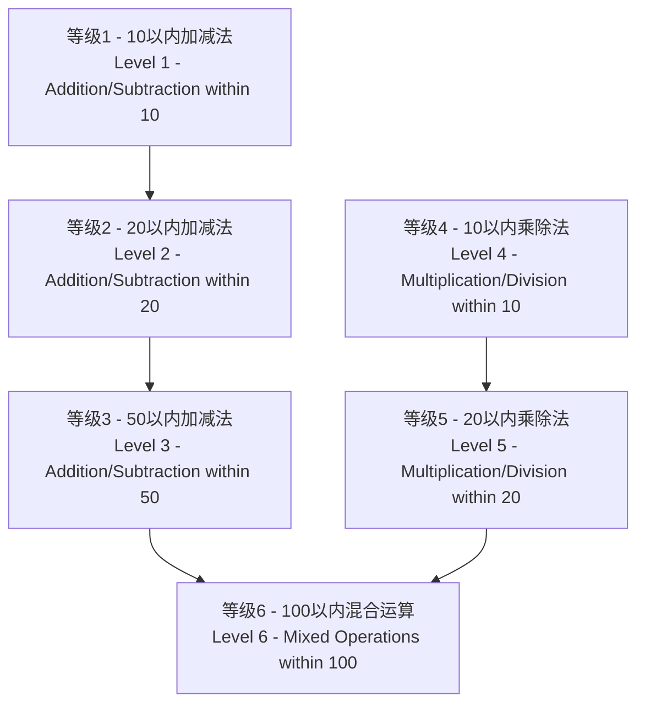

<div align="center">

# 🧮 小学生算术学习应用
## Elementary Arithmetic Learning App

[](https://github.com/tobecrazy/Arithmetic)

[](https://developer.apple.com/ios/)
[](https://swift.org/)
[](https://developer.apple.com/xcode/swiftui/)
[](LICENSE)

*一个使用SwiftUI开发的智能算术学习应用，帮助小学生掌握基础四则运算*

*An intelligent arithmetic learning application built with SwiftUI to help elementary students master basic mathematical operations*

[🚀 快速开始](#-快速开始-quick-start) • [✨ 功能特点](#-功能特点-features) • [📥 安装说明](#-安装说明-installation) • [🏗️ 技术实现](#️-技术实现-technical-implementation)

</div>

---

## 📋 目录 (Table of Contents)

- [✨ 功能特点 (Features)](#-功能特点-features)
- [🚀 快速开始 (Quick Start)](#-快速开始-quick-start)
- [🎯 难度等级系统 (Difficulty Levels)](#-难度等级系统-difficulty-levels)
- [⚙️ 系统要求 (Requirements)](#️-系统要求-requirements)
- [📥 安装说明 (Installation)](#-安装说明-installation)
- [📖 使用说明 (Usage)](#-使用说明-usage)
- [🏗️ 技术实现 (Technical Implementation)](#️-技术实现-technical-implementation)
- [📁 项目结构 (Project Structure)](#-项目结构-project-structure)
- [🔄 最近更新 (Recent Updates)](#-最近更新-recent-updates)
- [🤝 贡献指南 (Contributing)](#-贡献指南-contributing)
- [📄 许可证 (License)](#-许可证-license)

---

## ✨ 功能特点 (Features)

<div align="center">

| 🎯 核心功能 | 🧠 智能系统 | 🌐 用户体验 |
|------------|------------|------------|
| 6级难度体系 | 错题收集分析 | 中英文双语 |
| 四则运算练习 | 8种解题方法 | 设备自适应 |
| 实时计分系统 | 进度自动保存 | 响应式设计 |
| TTS语音朗读 | 九九乘法表 | 深色模式支持 |

</div>

### 🔍 错题收集系统 (Wrong Questions Collection System)
- **智能收集 (Intelligent Collection)** - 自动收集用户答错的题目 (Automatically collects user's wrong answers)
- **多入口访问 (Multiple Access Points)** - 从主页面和结果页面均可访问错题集 (Accessible from both main page and result page)
- **分类管理 (Categorized Management)** - 按难度等级分类错题 (Categorizes wrong questions by difficulty level)
- **统计分析 (Statistical Analysis)** - 显示错题统计信息（展示次数、错误次数） (Shows statistics like display count, error count)
- **灵活删除 (Flexible Deletion)** - 支持删除单个错题、所有错题或已掌握的错题 (Supports deleting individual, all, or mastered wrong questions)
- **智能识别 (Smart Recognition)** - 自动识别已掌握的错题（正确率达到70%以上） (Automatically identifies mastered questions with 70%+ accuracy)
- **优先练习 (Priority Practice)** - 错题集中的题目会在后续练习中优先出现，帮助巩固薄弱点 (Questions appear with priority in subsequent practice to help consolidate weak points)

### 🎯 智能解题方法 (Intelligent Solution Methods)
- **加法方法 (Addition Method)** - 凑十法 (Making Ten Method)
- **减法方法 (Subtraction Methods)** - 破十法 (Breaking Ten Method), 借十法 (Borrowing Ten Method), 平十法 (Leveling Ten Method)
- **乘法方法 (Multiplication Methods)** - 乘法口诀法 (Multiplication Table Method), 分解乘法 (Decomposition Multiplication)
- **除法方法 (Division Methods)** - 除法验算法 (Division Verification), 分组除法 (Grouping Division)
- **智能选择 (Smart Selection)** - 系统自动选择最适合的解题方法进行解析 (System automatically selects the most suitable solution method for analysis)

### 🔢 九九乘法表 (9×9 Multiplication Table)
- **完整乘法表 (Complete Multiplication Table)** - 展示1×1到9×9的完整乘法运算表 (Shows complete multiplication table from 1×1 to 9×9)
- **颜色分级 (Color Grading)** - 不同颜色标识不同难度级别，便于学习识别 (Different colors indicate difficulty levels for easier learning recognition)
  - 🔵 蓝色：相同数字相乘（1×1, 2×2等） (Blue: Same number multiplication (1×1, 2×2, etc.))
  - 🟢 绿色：结果≤10的简单运算 (Green: Simple operations with results ≤10)
  - 🟠 橙色：结果11-50的中等运算 (Orange: Medium operations with results 11-50)
  - 🔴 红色：结果>50的挑战运算 (Red: Challenging operations with results >50)
- **响应式布局 (Responsive Layout)** - 根据设备类型自动调整网格列数 (Automatically adjusts grid columns based on device type)
  - iPad横屏：9列完整显示 (iPad Landscape: 9 columns for full display)
  - iPad竖屏：6列优化阅读 (iPad Portrait: 6 columns for optimized reading)
  - iPhone横屏：6列适配 (iPhone Landscape: 6 columns for adaptation)
  - iPhone竖屏：3列紧凑显示 (iPhone Portrait: 3 columns for compact display)
- **双向滚动 (Bidirectional Scrolling)** - 支持垂直和水平滚动，确保所有内容可访问 (Supports vertical and horizontal scrolling to ensure all content is accessible)
- **学习辅助 (Learning Aid)** - 作为乘法练习的参考工具，帮助学生记忆乘法口诀 (As a reference tool for multiplication practice, helps students memorize multiplication tables)

### 🔊 九九乘法表双语发音 (Bilingual TTS for Multiplication Table)
- **真人发音 (Human-like Pronunciation)** - 集成iOS原生TTS引擎，提供清晰的真人发音 (Integrated with the native iOS TTS engine for clear, human-like speech)
- **双语支持 (Bilingual Support)** - 支持中英文双语发音，用户可以根据系统语言或应用内设置切换 (Supports both Chinese and English pronunciation, which can be switched based on system language or in-app settings)
- **即时反馈 (Instant Feedback)** - 点击乘法表中的任意按钮，即可听到对应的乘法表达式发音，如"三七二十一"或"three times seven is twenty-one" (Tap any button in the multiplication table to hear the corresponding multiplication expression, such as "三七二十一" or "three times seven is twenty-one")
- **学习辅助 (Learning Aid)** - 帮助儿童通过听觉学习，加深对乘法口诀的记忆 (Helps children learn and memorize the multiplication table through auditory feedback)

### 🎤 问题朗读功能 (Question Read-Aloud Feature)

#### 🎯 中文版功能特点 (Chinese Version Features)
- **智能语音朗读** - 在游戏界面，点击任意题目文本即可朗读当前算术题
- **数学符号智能识别** - 自动将数学运算符转换为标准中文读音
  - "+" 读作"加"
  - "-" 读作"减"
  - "×" 读作"乘以"
  - "÷" 读作"除以"
  - "=" 读作"等于"
- **数字智能转换** - 将阿拉伯数字转换为中文数字读音（如"8"读作"八"）
- **完整句式朗读** - 按照"计算[题目]等于多少？"的标准格式朗读
- **听觉学习辅助** - 特别适合低年级学生和需要听觉辅助的学习者

#### 🌍 English Version Features (English Version Features)
- **Intelligent Voice Reading** - Tap any question text in the game interface to hear the current arithmetic problem read aloud
- **Mathematical Symbol Recognition** - Automatically converts mathematical operators to standard English pronunciation
  - "+" pronounced as "plus"
  - "-" pronounced as "minus"
  - "×" pronounced as "times"
  - "÷" pronounced as "divided by"
  - "=" pronounced as "equals"
- **Number Conversion** - Converts Arabic numerals to spelled-out English numbers (e.g., "8" pronounced as "eight")
- **Complete Sentence Reading** - Reads in the standard format "What is [question]?"
- **Auditory Learning Support** - Especially suitable for young students and learners who need auditory assistance

#### 🔧 技术特性 (Technical Features)
- **原生TTS引擎 (Native TTS Engine)** - 基于iOS原生AVSpeechSynthesizer，确保高质量语音输出 (Built on iOS native AVSpeechSynthesizer for high-quality voice output)
- **自适应语言切换 (Adaptive Language Switching)** - 根据应用当前语言设置自动选择中文或英文发音 (Automatically selects Chinese or English pronunciation based on current app language settings)
- **无缝交互体验 (Seamless Interactive Experience)** - 题目文本外观保持不变，点击即可触发朗读功能 (Question text appearance remains unchanged, tap to trigger read-aloud functionality)

### 🧠 错题解析系统 (Wrong Question Analysis System)

#### 📐 加减法解析方法（适用于等级2 - 20以内加减法）(Addition/Subtraction Analysis Methods - Applicable to Level 2 - Addition/Subtraction within 20)
- **🔟 凑十法 (Making Ten Method)** 
  - 适用于个位数相加且和大于10的情况 (Applicable when adding single digits with sum greater than 10)
  - 通过将一个数分解来凑成10，然后加上剩余部分 (Decompose one number to make 10, then add the remainder)
- **💥 破十法 (Breaking Ten Method)** 
  - 适用于减法运算中被减数的个位数字小于减数的个位数字的情况 (Applicable when the units digit of the minuend is less than that of the subtrahend in subtraction)
  - 将被减数分解为10和余数，用10减去减数得到一个结果，再与余数相加 (Decompose the minuend into 10 and remainder, subtract the subtrahend from 10, then add to the remainder)
- **📊 平十法 (Leveling Ten Method)** 
  - 适用于减法运算，将减数分解为两部分 (Applicable to subtraction, decompose the subtrahend into two parts)
  - 使得被减数减去第一部分等于10，然后用10减去第二部分得到结果 (Make the minuend minus the first part equal 10, then subtract the second part from 10)
- **🔄 借十法 (Borrowing Ten Method)** 
  - 适用于个位数不够减的情况，从十位借1当10来计算 (Applicable when units digit is insufficient for subtraction, borrow 1 from tens place as 10)

#### 🔢 乘除法解析方法（适用于等级4和等级5）(Multiplication/Division Analysis Methods - Applicable to Levels 4 and 5)
- **📚 乘法口诀法 (Multiplication Table Method)** - 基于乘法口诀表的标准乘法计算 (Standard multiplication calculation based on multiplication tables)
- **🧩 分解乘法 (Decomposition Multiplication)** - 将较大数分解为十位和个位，分别相乘后相加 (Decompose larger numbers into tens and units, multiply separately then add)
- **✅ 除法验算法 (Division Verification)** - 通过乘法验证除法结果的正确性 (Verify division results using multiplication)
- **👥 分组除法 (Grouping Division)** - 通过分组的方式理解除法概念 (Understand division concept through grouping)

> **💡 智能解析特点 (Intelligent Analysis Features)**
> - 系统自动选择最适合的解题方法进行解析 (System automatically selects the most suitable analysis method)
> - 对于三数运算，分两步应用这些方法：先计算前两个数，再将结果与第三个数计算 (For three-number operations, apply these methods in two steps: calculate the first two numbers, then apply the result with the third number)
> - 完全支持中英文双语解析内容 (Fully supports bilingual analysis content in Chinese and English)
> - 通过直观的步骤说明帮助学生理解解题思路和中国传统算术方法 (Helps students understand problem-solving approaches and traditional Chinese arithmetic methods through intuitive step-by-step explanations)

### 🎤 问题朗读功能 (Question Read-Aloud Feature)

#### 🎯 中文版功能特点
- **智能语音朗读** - 在游戏界面，点击任意题目文本即可朗读当前算术题
- **数学符号智能识别** - 自动将数学运算符转换为标准中文读音
  - "+" 读作"加"
  - "-" 读作"减"
  - "×" 读作"乘以"
  - "÷" 读作"除以"
  - "=" 读作"等于"
- **数字智能转换** - 将阿拉伯数字转换为中文数字读音（如"8"读作"八"）
- **完整句式朗读** - 按照"计算[题目]等于多少？"的标准格式朗读
- **听觉学习辅助** - 特别适合低年级学生和需要听觉辅助的学习者

#### 🌍 English Version Features
- **Intelligent Voice Reading** - Tap any question text in the game interface to hear the current arithmetic problem read aloud
- **Mathematical Symbol Recognition** - Automatically converts mathematical operators to standard English pronunciation
  - "+" pronounced as "plus"
  - "-" pronounced as "minus"
  - "×" pronounced as "times"
  - "÷" pronounced as "divided by"
  - "=" pronounced as "equals"
- **Number Conversion** - Converts Arabic numerals to spelled-out English numbers (e.g., "8" pronounced as "eight")
- **Complete Sentence Reading** - Reads in the standard format "What is [question]?"
- **Auditory Learning Support** - Especially suitable for young students and learners who need auditory assistance

#### 🔧 技术特性 (Technical Features)
- **原生TTS引擎** - 基于iOS原生AVSpeechSynthesizer，确保高质量语音输出
- **自适应语言切换** - 根据应用当前语言设置自动选择中文或英文发音
- **无缝交互体验** - 题目文本外观保持不变，点击即可触发朗读功能
- **Native TTS Engine** - Built on iOS native AVSpeechSynthesizer for high-quality voice output
- **Adaptive Language Switching** - Automatically selects Chinese or English pronunciation based on current app language settings
- **Seamless Interactive Experience** - Question text appearance remains unchanged, tap to trigger read-aloud functionality

### 💾 游戏进度保存 (Game Progress Saving)
- **自动保存 (Auto Save)** - 自动保存游戏进度 (Automatically saves game progress)
- **断点续练 (Resume from Breakpoint)** - 支持暂停游戏并在稍后继续 (Supports pausing the game and continuing later)
- **全面记录 (Comprehensive Recording)** - 保存当前难度等级、分数、剩余时间和答题进度 (Saves current difficulty level, score, remaining time and question progress)
- **进度显示 (Progress Display)** - 显示上次保存的时间和进度信息 (Displays the last saved time and progress information)

### 🎲 题目生成系统 (Question Generation System)
- **不重复生成 (Non-repetitive Generation)** - 根据难度等级生成不同数量的不重复算术题 (Generates different quantities of non-repetitive arithmetic questions based on difficulty levels)
- **🔢 整数结果保证 (Integer Result Guarantee)** - 所有算术运算（加减乘除）均产生整数结果，无小数或分数 (All arithmetic operations (addition, subtraction, multiplication, division) produce integer results, no decimals or fractions)
- **📈 智能难度递进 (Intelligent Difficulty Progression)** - 难度越高，三数运算出现概率越大 (Higher difficulty levels have greater probability of three-number operations)
- **🎯 智能题目质量控制 (Intelligent Question Quality Control)**：
  - **乘法优化 (Multiplication Optimization)** - ×1题目占比降至5%，大幅提高教学价值 (×1 questions reduced to 5%, significantly improving educational value)
  - **除法优化 (Division Optimization)** - 完全避免÷1，除数范围2-10，避免相同数字除法 (Completely avoids ÷1, divisor range 2-10, avoids same number divisions)
  - **减法优化 (Subtraction Optimization)** - 避免相同数字相减，确保差值至少为2，提高计算挑战性 (Avoids same number subtraction, ensures difference is at least 2, increasing calculation challenge)
  - **商值控制 (Quotient Control)** - 90%概率避免商为1的简单除法，优先生成有意义的计算题目 (90% probability avoids simple division with quotient of 1, prioritizes meaningful calculation questions)

### ⏱️ 时间管理系统 (Time Management System)
- **灵活时间设置 (Flexible Time Setting)** - 可配置限制时间：3-30分钟 (Configurable time limit: 3-30 minutes)
- **实时倒计时 (Real-time Countdown)** - 显示倒计时器 (Displays countdown timer)
- **自动结束 (Automatic End)** - 时间到自动结束答题并计算成绩 (Automatically ends the quiz and calculates score when time is up)
- **智能重置 (Smart Reset)** - 重新开始游戏时自动重置计时器 (Automatically resets the timer when restarting the game)

### 🌐 多语言支持 (Language Settings)
- **双语界面** - 支持中文和英文界面
- **实时切换** - 可随时切换语言
- **完整本地化** - 包括解析内容的完整双语支持

### 🖼️ 图片缓存功能 (Image Caching Feature)
- **智能缓存 (Intelligent Caching)** - 自动缓存"关于我"页面的开发者头像 (Automatically caches developer avatars on the "About Me" page)
- **二级存储 (Two-level Storage)** - 结合内存缓存和磁盘缓存，提高加载速度 (Combines memory and disk caching to improve loading speed)
- **离线访问 (Offline Access)** - 网络异常时也能显示已缓存的图片 (Displays cached images even when network is unavailable)
- **存储优化 (Storage Optimization)** - 自动管理缓存大小，避免占用过多存储空间 (Automatically manages cache size to avoid excessive storage usage)

### 🌐 GitHub仓库链接 (GitHub Repository Link)
- **便捷访问 (Convenient Access)** - 在"关于我"页面新增GitHub仓库链接 (Added GitHub repository link to the "About Me" page)
- **开源支持 (Open Source Support)** - 用户可直接访问项目开源地址，了解开发进展 (Users can directly access the project's open source repository to understand development progress)
- **中英双语 (Bilingual Support)** - 支持中文"点击访问我的Github仓库"和英文"Visit GitHub Repository"本地化文本 (Supports localized text in Chinese "点击访问我的Github仓库" and English "Visit GitHub Repository")

### 🔋 电池监控与运行时长功能 (Battery Monitoring and Uptime Calculation)
- **实时电池状态 (Real-time Battery Status)** - 实时监控设备电池电量、充电状态和电源类型 (Real-time monitoring of device battery level, charging status, and power source type)
- **智能状态检测 (Smart Status Detection)** - 解决模拟器中电池状态显示"Unknown"的问题，提供智能状态推断 (Resolves the issue of battery status showing "Unknown" in simulator, provides intelligent status inference)
- **运行时长计算 (Uptime Calculation)** - 精确计算并实时更新系统自启动以来的运行时长 (Precisely calculates and updates the system uptime since boot in real-time)
- **智能格式化显示 (Smart Formatting Display)** - 根据运行时长自动选择合适的显示格式（天数、时:分:秒或分:秒） (Automatically selects appropriate display format based on uptime (days, HH:MM:SS, or MM:SS))
- **多场景支持 (Multi-scenario Support)** - 支持iOS模拟器和真实设备的电池状态检测 (Supports battery status detection for both iOS simulator and real devices)
- **国际化支持 (Internationalization Support)** - 完整的中英文本地化支持 (Complete Chinese and English localization support)

### 🌐 网络连接监控 (Network Connection Monitoring)
- **实时网络状态 (Real-time Network Status)** - 检测当前网络连接类型（Wi-Fi/蜂窝网络） (Detects current network connection type (Wi-Fi/cellular))
- **Wi-Fi信息 (Wi-Fi Information)** - 显示Wi-Fi连接名称（SSID） (Displays Wi-Fi connection name (SSID))
- **蜂窝网络信息 (Cellular Information)** - 显示运营商信息（如适用） (Displays carrier information (where applicable))
- **连接状态指示 (Connection Status Indicator)** - 提供网络连接状态的实时反馈 (Provides real-time feedback on network connection status)

### 💻 系统信息显示 (System Information Display)
- **设备信息 (Device Information)** - 显示当前设备名称和CPU信息 (Displays current device name and CPU information)
- **实时监控 (Real-time Monitoring)** - CPU占用率、内存使用情况和磁盘空间实时更新 (CPU usage, memory usage, and disk space update in real-time)
- **内存详情 (Memory Details)** - 显示已使用、总内存、可用内存和使用百分比 (Shows used, total, available memory and usage percentage)
- **磁盘空间 (Disk Space)** - 显示已使用、总磁盘空间、可用磁盘空间和使用百分比 (Shows used, total disk space, available disk space and usage percentage)
- **屏幕信息 (Screen Information)** - 显示屏幕分辨率、尺寸和刷新率 (Displays screen resolution, size, and refresh rate)
- **系统版本 (System Version)** - 显示当前iOS/iPadOS系统版本 (Displays current iOS/iPadOS system version)
- **当前时间 (Current Time)** - 实时显示当前时间，每秒更新 (Real-time display of current time, updated every second)
- **双语支持 (Bilingual Support)** - 完整的中英文本地化支持 (Complete Chinese and English localization support)
- **可视化展示 (Visual Display)** - 使用进度条和图标直观显示系统状态 (Uses progress bars and icons to intuitively show system status)

### 🌐 多语言支持 (Language Settings)
- **双语界面 (Bilingual Interface)** - 支持中文和英文界面 (Supports both Chinese and English interfaces)
- **实时切换 (Real-time Switching)** - 可随时切换语言 (Language can be switched at any time)
- **完整本地化 (Complete Localization)** - 包括解析内容的完整双语支持 (Full bilingual support including analysis content)

### 📐 新增小学数学公式大全 (New Elementary Math Formula Guide)
- ** comprehensive Formula Guide ** - 新增全面的小学数学公式指南 (Added a comprehensive elementary math formula guide)
- **几何形体计算 (Geometry Calculations)** - 包含平面图形和立体图形的周长、面积、体积公式 (Includes perimeter, area, and volume formulas for plane and solid figures)
  - 平面图形：长方形、正方形、三角形、平行四边形、梯形、圆形 (Plane figures: Rectangle, Square, Triangle, Parallelogram, Trapezoid, Circle)
  - 立体图形：长方体、正方体、圆柱、圆锥 (Solid figures: Cuboid, Cube, Cylinder, Cone)
- **单位换算 (Unit Conversions)** - 涵盖长度、面积、体积、质量、时间等单位换算 (Covers length, area, volume, mass, and time unit conversions)
- **数量关系 (Quantity Relations)** - 包含基本关系和四则运算关系公式 (Includes basic relations and arithmetic operation relation formulas)
- **运算定律 (Arithmetic Laws)** - 包括加法、乘法交换律和结合律、乘法分配律等 (Includes commutative, associative laws of addition and multiplication, distributive law, etc.)
- **特殊问题 (Special Problems)** - 涵盖和差问题、和倍问题、植树问题、相遇问题、追及问题、利润问题等 (Covers sum-difference problems, sum-multiple problems, tree planting problems, meeting problems, chase problems, profit problems, etc.)
- **便捷访问 (Convenient Access)** - 从"其他选项"页面可直接访问公式大全 (The formula guide can be accessed directly from the "Other Options" page)

### 🎨 UI界面优化 (UI Improvements)
- **简洁选择器 (Cleaner Picker)** - 隐藏难度选择器标签，创建更清洁的界面 (Difficulty picker labels are now hidden to create a cleaner interface)
- **自定义导航 (Custom Navigation)** - 在多个视图中添加自定义返回按钮功能 (Added custom back button functionality across multiple views)
- **布局优化 (Layout Refinements)** - 调整选择器对齐和整体布局改进 (Adjusted picker alignment and overall layout improvements)
- **视图简化 (View Simplification)** - 移除不必要的NavigationView包装器以获得更好的性能 (Removed unnecessary NavigationView wrappers for better performance)
- **欢迎引导流程 (Onboarding Flow)** - 新增首次启动引导界面，提供4页交互式介绍 (Added first-launch onboarding interface with 4-page interactive introduction)
- **AppStorage集成 (AppStorage Integration)** - 使用@AppStorage优化首启动状态管理，提升用户体验 (Utilized @AppStorage to optimize first launch state management, enhancing user experience)

[⬆️ 返回目录](#-目录-table-of-contents)

---

## 🚀 快速开始 (Quick Start)

### 📱 基本使用流程 (Basic Usage Flow)

#### 🌟 首次使用体验 (First-Time Experience)
1. **欢迎引导** - 首次启动应用时，将显示4页交互式引导界面
   - 了解应用功能、难度体系、核心特性和使用方法
   - 可随时点击"跳过"进入主界面，或滑动到最后一页点击"开始使用"
2. **进入主界面** - 完成引导或跳过后进入主界面

#### 🎮 日常使用流程 (Daily Usage Flow)
1. **选择难度** - 在主页面选择适合的难度等级（1-6级）
2. **设置时间** - 配置答题时间（3-30分钟）
3. **选择语言** - 选择界面语言（中文或英文）
4. **开始练习** - 点击"开始游戏"按钮开始答题
5. **查看解析** - 答错题目后可立即查看详细解析
6. **错题复习** - 通过错题集功能巩固薄弱环节

#### 🌍 First-Time Experience
1. **Welcome Onboarding** - When launching the app for the first time, a 4-page interactive onboarding interface will be displayed
   - Learn about app features, difficulty system, core functions, and usage methods
   - Click "Skip" at any time to enter the main interface, or swipe to the last page and click "Start Using"
2. **Enter Main Interface** - Proceed to the main interface after completing or skipping the onboarding

#### 🎮 Daily Usage Flow
1. **Select Difficulty** - Choose appropriate difficulty level (Level 1-6) on the main page
2. **Set Time** - Configure answering time (3-30 minutes)
3. **Choose Language** - Select interface language (Chinese or English)
4. **Start Practice** - Click "Start Game" button to begin answering
5. **View Analysis** - Check detailed analysis immediately after wrong answers
6. **Review Wrong Questions** - Consolidate weak points through wrong questions collection

### 🎯 推荐学习路径 (Recommended Learning Path)


[⬆️ 返回目录](#-目录-table-of-contents)

---

## 🎯 难度等级系统 (Difficulty Levels)

<div align="center">

| 等级 | 运算类型 | 题目数量 | 每题分值 | 总分 | 特色功能 |
|------|----------|----------|----------|------|----------|
| **Level 1** | 10以内加减法 | 20题 | 5分 | 100分 | 基础入门 |
| **Level 2** | 20以内加减法 | 25题 | 4分 | 100分 | 🔟 四种解法 |
| **Level 3** | 50以内加减法 | 50题 | 2分 | 100分 | 进阶练习 |
| **Level 4** | 10以内乘除法 | 20题 | 5分 | 100分 | 🔢 口诀基础 |
| **Level 5** | 20以内乘除法 | 25题 | 4分 | 100分 | 🧩 分解方法 |
| **Level 6** | 100以内混合运算 | 100题 | 1分 | 100分 | 🔄 综合应用 |

</div>

### 📊 运算类型详解 (Operation Type Details)

#### 🟢 加减法等级（Level 1-3）(Addition/Subtraction Levels (Level 1-3))
- **Level 1**: 两个数字的基础加减法运算 (Basic addition/subtraction operations with two numbers)
- **Level 2-3**: 
  - 两个数字的加减法运算 (Addition/subtraction operations with two numbers)
  - 三个数字的连加、连减或加减混合运算（如 `5 + 3 - 2 = ?`）(Sequential addition, subtraction or mixed operations with three numbers, e.g., `5 + 3 - 2 = ?`)
  - 难度递进：Level 2（40%三数运算）→ Level 3（60%三数运算）(Difficulty progression: Level 2 (40% three-number operations) → Level 3 (60% three-number operations))

#### 🔵 乘除法等级（Level 4-5）(Multiplication/Division Levels (Level 4-5))
- **纯乘除法运算 (Pure multiplication/division operations)** - 只生成乘法和除法题目，不包含加减法 (Generates only multiplication and division questions, no addition or subtraction)
- **整除保证 (Division guarantee)** - 所有除法题目采用"商×除数=被除数"的逆向生成方式，确保100%整除 (All division questions use reverse generation ("quotient × divisor = dividend") to ensure 100% divisibility)
- **Level 4**: 基于乘法口诀表的10以内乘除法 (Multiplication/division within 10 based on multiplication tables)
- **Level 5**: 包含分解乘法的20以内乘除法 (Multiplication/division within 20 including decomposition multiplication)

#### 🟡 混合运算等级（Level 6）(Mixed Operations Level (Level 6))
- **两数运算 (Two-number operations)**: 包含加减法或乘除法的题目 (Questions containing addition/subtraction or multiplication/division)
- **三数运算 (Three-number operations)**: 包含加减乘除四种运算的混合题目 (Mixed questions containing all four operations: addition, subtraction, multiplication, division)
- **运算顺序 (Operation order)**: 严格遵循先乘除后加减的运算顺序 (Strictly follows the order of multiplication/division before addition/subtraction)
- **智能组合 (Smart combination)**: 确保混合运算中每步计算都产生合理的整数结果 (Ensures each step in mixed operations produces reasonable integer results)

[⬆️ 返回目录](#-目录-table-of-contents)

---

## ⚙️ 系统要求 (System Requirements)

### 📱 设备支持 (Device Support)
- **iPhone**: iOS 15.0+ 
- **iPad**: iPadOS 15.0+
- **处理器 (Processor)**: A12 Bionic或更新 / A12 Bionic or newer
- **存储空间 (Storage)**: 50MB可用空间 / 50MB available storage

### 🛠️ 开发环境 (Development Environment)
- **macOS**: 12.0+ (Monterey)
- **Xcode**: 13.0+
- **Swift**: 5.5+
- **SwiftUI**: 3.0+

### 🌐 语言支持 (Language Support)
- **简体中文 (Simplified Chinese)** (zh-Hans) / **Simplified Chinese**
- **English** (en) / **英文 (Chinese)**

[⬆️ 返回目录](#-目录-table-of-contents)

---

## 📥 安装说明 (Installation)

### 🛠️ 开发环境要求 (Development Environment Requirements)
- **Xcode**: 13.0+
- **iOS**: 15.0+
- **Swift**: 5.5+
- **SwiftUI**: 3.0+

### 📦 安装步骤 (Installation Steps)

1. **克隆仓库 (Clone Repository)**
   ```bash
   git clone https://github.com/tobecrazy/Arithmetic.git
   cd Arithmetic
   ```

2. **打开项目 (Open Project)**
   ```bash
   open Arithmetic.xcodeproj
   ```

3. **选择目标设备 (Select Target Device)**
   - iPhone模拟器或实机 / iPhone Simulator or Physical Device
   - iPad模拟器或实机（已优化横屏模式）/ iPad Simulator or Physical Device (optimized for landscape mode)

4. **构建运行 (Build and Run)**
   - 点击运行按钮或按下 `Cmd+R` / Click the Run button or press `Cmd+R`
   - 等待构建完成并自动启动应用 / Wait for build completion and automatic app launch

### 🔧 故障排除 (Troubleshooting)
- 确保Xcode版本满足要求 / Ensure Xcode version meets requirements
- 检查iOS部署目标设置 / Check iOS deployment target settings
- 清理构建缓存：`Product → Clean Build Folder` / Clean build cache: `Product → Clean Build Folder`

[⬆️ 返回目录](#-目录-table-of-contents)

---

## 📖 使用说明 (Usage Instructions)

### 🎮 游戏操作流程 (Game Operation Flow)

1. **🏠 主页操作 (Home Page Operations)**
   - 选择难度等级（1-6级）/ Select difficulty level (Level 1-6)
   - 设置答题时间（3-30分钟）/ Set answering time (3-30 minutes)
   - 选择界面语言（中文/英文）/ Choose interface language (Chinese/English)
   - 点击"开始游戏"或"错题集" / Click "Start Game" or "Wrong Questions"

2. **📝 答题页面 (Answer Page)**
   - 查看题目并输入答案 / View questions and input answers
   - **点击题目文本可朗读当前问题** / **Tap question text to hear current question read aloud**
   - 点击"提交"按钮确认答案 / Click "Submit" button to confirm answer
   - 答错时可点击"查看解析"查看详细步骤 / Click "View Analysis" for detailed steps when wrong
   - 实时查看得分和剩余时间 / View real-time score and remaining time

3. **📊 结果页面 (Result Page)**
   - 查看最终得分和评价 / View final score and evaluation
   - 点击"错题集"查看本次错题 / Click "Wrong Questions" to view current wrong answers
   - 选择"重新开始"或"返回主页" / Choose "Restart" or "Return to Home"

4. **📚 错题集管理 (Wrong Questions Management)**
   - 按难度等级筛选错题 / Filter wrong questions by difficulty level
   - 查看错题的详细解析 / View detailed analysis of wrong questions
   - 删除已掌握的题目 / Delete mastered questions
   - 清空所有错题记录 / Clear all wrong question records

### 🎯 学习建议 (Learning Suggestions)

- **循序渐进** - 从低等级开始，逐步提高难度 / **Progressive Learning** - Start from low levels and gradually increase difficulty
- **错题重练** - 重点关注错题集，反复练习薄弱环节 / **Wrong Question Review** - Focus on wrong questions collection and repeatedly practice weak points
- **理解解析** - 仔细阅读解题步骤，掌握解题方法 / **Understand Analysis** - Carefully read solution steps and master problem-solving methods
- **定期复习** - 利用进度保存功能，保持学习连续性 / **Regular Review** - Use progress saving feature to maintain learning continuity

[⬆️ 返回目录](#-目录-table-of-contents)

---

## 🏗️ 技术实现 (Technical Implementation)

### 🏛️ 架构设计 (Architecture Design)
- **设计模式 (Design Pattern)**: MVVM (Model-View-ViewModel)
- **UI框架 (UI Framework)**: SwiftUI 3.0+
- **数据持久化 (Data Persistence)**: Core Data
- **本地化 (Localization)**: iOS标准本地化机制 (iOS standard localization mechanism)
- **响应式设计 (Responsive Design)**: GeometryReader + 环境值适配 (Environment value adaptation)

### 🧮 核心算法 (Core Algorithms)

#### 🎲 智能题目生成 (Intelligent Question Generation)
```swift
// 题目生成核心逻辑 (Core logic for question generation)
- 不重复算法：使用Set确保题目唯一性 (Non-repetitive algorithm: Use Set to ensure question uniqueness)
- 整数保证：除法采用"商×除数=被除数"逆向生成，确保100%整除 (Integer guarantee: Division uses "quotient×divisor=dividend" reverse generation to ensure 100% divisibility)
- 质量控制：智能权重系统避免简单题目（如×1运算仅占5%）(Quality control: Intelligent weight system to avoid simple questions (e.g., ×1 operations only account for 5%))
- 难度递进：基于概率的三数运算生成（Level 2: 40%, Level 3: 60%）(Difficulty progression: Probability-based three-number operations generation (Level 2: 40%, Level 3: 60%))
- 乘除法优化：避免÷1运算，除数范围2-10，确保有意义的计算题目 (Multiplication/division optimization: Avoid ÷1 operations, divisor range 2-10, ensure meaningful calculation questions)
```

#### 🔍 解题方法选择 (Problem-Solving Method Selection)
```swift
// 解题方法智能选择 (Intelligent problem-solving method selection)
- 基于题目特征自动选择最适合的解题方法 (Automatically select the most suitable solution method based on question characteristics)
- 支持8种不同的解题策略（凑十法、破十法、借十法、平十法、乘法口诀法、分解乘法、除法验算法、分组除法）(Supports 8 different solution strategies (Making Ten Method, Breaking Ten Method, Borrowing Ten Method, Leveling Ten Method, Multiplication Table Method, Decomposition Multiplication, Division Verification, Grouping Division))
- 三数运算分步解析 (Step-by-step analysis for three-number operations)
- 完整的中英文解析生成 (Complete Chinese/English analysis generation)
```

### 🎤 问题朗读系统 (Question Read-Aloud System)
```swift
// TTS智能语音系统 (TTS Intelligent Voice System)
- TTSHelper单例模式，统一管理语音合成 (TTSHelper singleton pattern, unified management of speech synthesis)
- speakMathExpression()方法，智能处理数学表达式 (speakMathExpression() method, intelligent processing of mathematical expressions)
- 运算符正则表达式替换，确保标准读音 (Operator regular expression replacement, ensuring standard pronunciation)
- 数字转换为拼写形式，提高语音自然度 (Number conversion to spelling form, improving voice naturalness)
- 双语言环境自适应切换 (Bilingual environment adaptive switching)
- 支持加减乘除运算符的正确发音 (Support for correct pronunciation of +, -, ×, ÷ operators)
```

### 💾 数据管理 (Data Management)

#### Core Data 实体设计 (Core Data Entity Design)
- **WrongQuestionEntity** - 错题数据存储（包含题目、答案、解析、统计信息）(Wrong question data storage (containing question, answer, analysis, statistics))
- **GameProgressEntity** - 游戏进度保存（难度、分数、时间等）(Game progress saving (difficulty, score, time, etc.))
- **解析数据** - 包含完整的解题步骤信息 (Analysis data - contains complete solution step information)

#### 本地化系统 (Localization System)
- **双语资源 (Bilingual Resources)** - `zh-Hans.lproj` / `en.lproj`
- **动态切换 (Dynamic Switching)** - 运行时语言切换支持 (Runtime language switching support)
- **完整覆盖 (Complete Coverage)** - UI文本和解析内容全面本地化 (Comprehensive localization of UI text and analysis content)

### 🔋 系统信息监控功能 (System Information Monitoring Function)

#### 实时监控模块 (Real-time Monitoring Module)
- **系统信息管理器 (System Information Manager)** - `SystemInfoManager.swift` 统一管理系统信息更新 (`SystemInfoManager.swift` unified system information update management)
- **设备信息 (Device Information)** - 实时获取设备名称、CPU信息、系统版本等 (Real-time acquisition of device name, CPU information, system version, etc.)
- **性能监控 (Performance Monitoring)** - CPU使用率、内存使用情况的实时更新 (Real-time updates of CPU usage, memory usage)
- **电池监控 (Battery Monitoring)** - 电池电量、充电状态、电源状态的实时检测 (Real-time detection of battery level, charging status, power status)
- **网络监控 (Network Monitoring)** - Wi-Fi和蜂窝网络连接状态检测 (Wi-Fi and cellular network connection status detection)
- **屏幕信息 (Screen Information)** - 分辨率、尺寸、刷新率等屏幕规格检测 (Screen specification detection such as resolution, size, refresh rate)
- **运行时长 (Uptime)** - 精确计算系统自启动以来的运行时间 (Precisely calculates system uptime since boot)

#### 系统信息组件 (System Information Components)
- **模块化设计 (Modular Design)** - 各类信息模块化设计，便于维护和扩展 (Various information modular design, easy to maintain and expand)
- **实时更新 (Real-time Updates)** - 使用计时器实现信息的定期更新 (Use timers to implement regular information updates)
- **可视化显示 (Visual Display)** - 使用进度条和图表直观显示资源使用情况 (Use progress bars and charts to visually display resource usage)
- **错误处理 (Error Handling)** - 优雅处理系统信息获取失败的情况 (Gracefully handle system information acquisition failures)

### 📱 设备适配 (Device Adaptation)
- **响应式布局 (Responsive Layout)** - 自适应iPhone/iPad不同屏幕尺寸 (Adapts to different iPhone/iPad screen sizes)
- **横屏优化 (Landscape Optimization)** - iPad横屏模式特别优化 (iPad landscape mode specially optimized)
- **字体适配 (Font Adaptation)** - 基于设备类型的自适应字体系统 (Adaptive font system based on device type)
- **输入优化 (Input Optimization)** - 数字键盘和外部键盘双重支持 (Dual support for numeric keypad and external keyboard)
- **UI优化 (UI Optimization)** - 支持深色模式和高对比度模式 (Supports dark mode and high contrast mode)

[⬆️ 返回目录](#-目录-table-of-contents)

---

## 📁 项目结构 (Project Structure)

```
Arithmetic/
├── 🗂️ .gitignore
├── 🖼️ Arithmetic.gif
├── ⚙️ Info.plist
├── 📄 LICENSE
├── 📝 Prompt.md
├── 📄 README.md
├── 📄 BATTERY_UPTIME_FIX_SUMMARY.md      # 电池和运行时长功能修复说明
├── 📄 CLAUDE.md                          # Claude开发助手对话记录
├── 📄 TTS_Implementation_Guide.md        # TTS功能实现指南
├── 📁 .qwen/                            # Qwen开发助手配置
├── 📱 App/
│   └── ArithmeticApp.swift                 # 应用入口
├── 🖼️ Assets.xcassets/                     # 资源资产
│   └── AppIcon.appiconset/                # 应用图标
├── 🖼️ Views/                               # 视图层
│   ├── WelcomeView.swift                  # 欢迎引导视图
│   ├── ContentView.swift                   # 主视图
│   ├── GameView.swift                      # 游戏视图
│   ├── ResultView.swift                    # 结果视图
│   ├── WrongQuestionsView.swift           # 错题集视图
│   ├── MultiplicationTableView.swift      # 九九乘法表视图
│   ├── LanguageSelectorView.swift         # 语言选择视图
│   ├── AboutMeView.swift                  # 关于我视图
│   ├── FormulaGuideView.swift             # 小学数学公式大全视图
│   ├── OtherOptionsView.swift             # 其他选项视图
│   ├── SystemInfoView.swift               # 系统信息视图
│   ├── SystemInfoComponents.swift         # 系统信息组件
│   └── CachedAsyncImageView.swift         # 图片缓存视图
├── 📊 Models/                              # 数据模型
│   ├── Question.swift                      # 题目模型（包含解析方法）
│   ├── DifficultyLevel.swift              # 难度等级模型
│   └── GameState.swift                     # 游戏状态模型
├── 🧠 ViewModels/                          # 视图模型
│   └── GameViewModel.swift                 # 游戏逻辑控制器
├── 💾 CoreData/                            # 数据持久化
│   ├── ArithmeticModel.swift              # Core Data模型
│   ├── CoreDataManager.swift              # 数据管理器
│   ├── WrongQuestionEntity.swift          # 错题实体
│   ├── WrongQuestionManager.swift         # 错题管理器
│   ├── GameProgressEntity.swift           # 进度实体
│   └── GameProgressManager.swift          # 进度管理器
├── 🛠️ Utils/                               # 工具类
│   ├── LocalizationManager.swift          # 本地化管理
│   ├── QuestionGenerator.swift            # 题目生成器
│   ├── NavigationUtil.swift               # 导航工具
│   ├── TTSHelper.swift                    # TTS辅助类
│   ├── DeviceUtils.swift                  # 设备工具
│   ├── SystemInfoManager.swift           # 系统信息管理器（含电池、网络、屏幕信息）
│   ├── ProgressViewUtils.swift            # 进度视图工具
│   └── ImageCacheManager.swift            # 图片缓存管理器
├── 🔧 Extensions/                          # 扩展
│   ├── String+Localized.swift             # 字符串本地化扩展
│   ├── Font+Adaptive.swift                # 字体适配扩展
│   ├── View+Navigation.swift              # 视图导航扩展
│   └── CGFloat+Adaptive.swift             # 尺寸适配扩展
└── 🌐 Resources/                           # 资源文件
    ├── zh-Hans.lproj/                     # 中文本地化
    │   └── Localizable.strings            # 中文本地化字符串
    └── en.lproj/                          # 英文本地化
        └── Localizable.strings            # 英文本地化字符串
```

## 🏗️ Core Data 集成 (Core Data Integration)

### 🗄️ 数据模型设计 (Data Model Design)
- **WrongQuestionEntity** - 存储错题信息（题目、答案、难度、解析、统计信息）(Stores wrong question information (question, answer, difficulty, analysis, statistics))
- **GameProgressEntity** - 存储游戏进度（难度、分数、时间、题目进度）(Stores game progress (difficulty, score, time, question progress))
- **自动迁移 (Auto Migration)** - 支持模型版本的自动迁移，确保数据向前兼容 (Supports automatic migration of model versions, ensuring data forward compatibility)

### 🗄️ 数据管理器 (Data Managers)
- **CoreDataManager** - Core Data栈的单例管理器，负责上下文管理 (Core Data stack singleton manager, responsible for context management)
- **WrongQuestionManager** - 错题数据的CRUD操作管理器 (CRUD operations manager for wrong question data)
- **GameProgressManager** - 游戏进度数据的CRUD操作管理器 (CRUD operations manager for game progress data)
- **性能优化 (Performance Optimization)** - 使用合适的并发队列确保主线程响应性 (Uses appropriate concurrent queues to ensure main thread responsiveness)

## 🎨 UI/UX 设计特点 (UI/UX Design Features)

### 🎨 视觉设计 (Visual Design)
- **适应性布局 (Adaptive Layout)** - 支持iPhone和iPad的自适应界面布局 (Supports adaptive interface layout for iPhone and iPad)
- **深色模式 (Dark Mode)** - 支持iOS系统深色模式 (Supports iOS system dark mode)
- **高对比度模式 (High Contrast Mode)** - 为视觉障碍用户提供高对比度支持 (Provides high contrast support for users with visual impairments)
- **动态字体 (Dynamic Fonts)** - 支持系统字体大小调整，确保可访问性 (Supports system font size adjustments to ensure accessibility)

### 🎯 用户体验 (User Experience)
- **直观导航 (Intuitive Navigation)** - 简洁明了的导航结构，用户易于理解和操作 (Clear and simple navigation structure, easy for users to understand and operate)
- **即时反馈 (Instant Feedback)** - 操作后立即提供视觉或听觉反馈 (Provides visual or auditory feedback immediately after operation)
- **手势支持 (Gesture Support)** - 支持常用的手势操作（点击、滑动等）(Supports common gesture operations (tap, swipe, etc.))
- **加载优化 (Loading Optimization)** - 优化加载时间，减少用户等待 (Optimizes loading time, reducing user wait)

[⬆️ 返回目录](#-目录-table-of-contents)

---

## 🔄 最近更新 (Recent Updates)

### 🌟 2025-11-07 (欢迎引导界面和用户体验优化)
- **🆕 新增欢迎引导功能**: 全新的4页交互式引导界面，首次启动时自动显示
  - **Page 1**: 应用介绍和主要功能概述 (App introduction and main features overview)
  - **Page 2**: 6级难度体系详细介绍，带星级难度指示器 (Detailed 6-level difficulty system introduction with star-level indicators)
  - **Page 3**: 核心功能展示，包括游戏、解题思路、错题集、九九乘法表 (Core features showcase including game, solution methods, wrong questions collection, multiplication table)
  - **Page 4**: 使用方法指导，分步骤说明如何使用应用 (Usage guidance with step-by-step instructions)
- **🎨 UI/UX 重大升级**:
  - **增强组件设计**: 新增EnhancedFeatureRow和EnhancedHowToRow组件，提供更精美的卡片式布局 (Enhanced component design: Added EnhancedFeatureRow and EnhancedHowToRow components with more refined card-style layouts)
  - **动画效果**: 添加页面切换动画和按钮缩放动画，提升交互体验 (Animation effects: Added page transition animations and button scaling animations for enhanced interaction experience)
  - **颜色主题**: 每个页面使用不同主题色彩，提升视觉识别度 (Color themes: Each page uses different theme colors for better visual recognition)
- **🔧 架构优化**:
  - **@AppStorage集成**: 使用@AppStorage替代UserDefaults进行首启动状态管理 (AppStorage integration: Using @AppStorage instead of UserDefaults for first launch state management)
  - **状态管理**: 优化ContentView中的显示逻辑，确保引导界面只显示一次 (State management: Optimized display logic in ContentView to ensure onboarding shows only once)
  - **模块化设计**: WelcomeView采用模块化设计，便于维护和扩展 (Modular design: WelcomeView uses modular design for easy maintenance and extension)
- **🌐 完整国际化**: 添加所有引导界面的中英文本地化支持
  - 新增50+本地化字符串，包括标题、描述、按钮文本等 (Added 50+ localized strings including titles, descriptions, button texts, etc.)
  - 支持中英文动态切换，确保所有文本正确显示 (Supports dynamic Chinese/English switching, ensuring all text displays correctly)

### 🎤 2025-09-30 (问题朗读功能重大增强)
- **🔧 核心代码优化**: 重构了GameView中的TTS调用逻辑，从`speak(text:language:)`升级为`speakMathExpression(_:language:)`
- **📢 数学符号智能转换**: 完全重写了数学运算符的语音处理系统
  - **中文语音**: "-" 正确读作"减"，"+" 读作"加"，"×" 读作"乘以"，"÷" 读作"除以"，"=" 读作"等于"
  - **数字转换**: 阿拉伯数字自动转换为中文读音（如"8"读作"八"）
  - **完整句式**: 按照"计算[题目]等于多少？"格式朗读
- **🎯 交互体验升级**:
  - 题目文本现在完全可点击，保持原有视觉外观
  - 使用`PlainButtonStyle()`确保无按钮样式干扰
  - 支持iPhone和iPad横竖屏所有布局模式
- **♿ 无障碍功能增强**: 为视觉学习困难和听觉学习者提供更好的辅助支持
- **⚡ 性能优化**: 使用TTSHelper单例模式，提高语音合成效率

### 🎤 2025-09-30 (Question Read-Aloud Feature Major Enhancement)
- **🔧 Core Code Optimization**: Refactored TTS call logic in GameView, upgraded from `speak(text:language:)` to `speakMathExpression(_:language:)`
- **📢 Mathematical Symbol Intelligent Conversion**: Completely rewrote the voice processing system for mathematical operators
  - **English Voice**: "-" correctly pronounced as "minus", "+" as "plus", "×" as "times", "÷" as "divided by", "=" as "equals"
  - **Number Conversion**: Arabic numerals automatically converted to spelled-out English (e.g., "8" pronounced as "eight")
  - **Complete Sentence Format**: Reads in "What is [question]?" format
- **🎯 Interaction Experience Upgrade**:
  - Question text is now fully clickable while maintaining original visual appearance
  - Uses `PlainButtonStyle()` to ensure no button styling interference
  - Supports all layout modes for iPhone and iPad in both portrait and landscape orientations
- **♿ Accessibility Enhancement**: Provides better assistive support for students with visual learning difficulties and auditory learners
- **⚡ Performance Optimization**: Uses TTSHelper singleton pattern to improve speech synthesis efficiency

### ⚙️ 2025-09-26 (应用图标修复)
- **🔧 关键修复**: 解决了应用图标在设备上无法正确显示的问题。
- **⚙️ 配置修正**: 向 `Info.plist` 文件添加了 `CFBundleIcons` 键，确保系统能正确识别图标集。
- **🎨 资源文件优化**: 简化了 `AppIcon.appiconset` 中的 `Contents.json` 文件，采用单一 1024x1024px 图标源并由 Xcode 自动生成所有尺寸，遵循了现代化的最佳实践，提高了图标管理的可靠性。

### ⚙️ 2025-09-26 (App Icon Fix)
- **🔧 Key Fix**: Resolved an issue where the app icon was not displaying correctly on devices.
- **⚙️ Configuration Correction**: Added the `CFBundleIcons` key to the `Info.plist` file to ensure the system correctly identifies the icon set.
- **🎨 Asset Optimization**: Simplified the `Contents.json` file within `AppIcon.appiconset` to use a single 1024x1024px source icon, allowing Xcode to auto-generate all required sizes. This follows modern best practices and improves the reliability of icon management.


### 🌟 2025-09-26 (新增GitHub仓库链接)
- **🔗 新增功能**: 在"关于我"页面添加了GitHub仓库链接
- **📖 开源支持**: 用户可以直接访问项目开源地址，了解开发进展和贡献代码
- **🌍 本地化**: 支持中英文双语显示，中文为"点击访问我的Github仓库"，英文为"Visit GitHub Repository"

### 🌟 2025-09-26 (Added GitHub Repository Link)
- **🔗 New Feature**: Added a GitHub repository link to the "About Me" page
- **📖 Open Source Support**: Users can directly access the project's open source repository to learn about development progress and contribute code
- **🌍 Localization**: Supports bilingual display with "点击访问我的Github仓库" in Chinese and "Visit GitHub Repository" in English


### 🎨 2025-09-26 (UI Improvements)
- **🎨 Cleaner Interface**: Hid labels in difficulty picker to create a cleaner user interface
- **🔙 Navigation Enhancement**: Added custom back button functionality to multiple views
- **📏 Layout Refinements**: Adjusted picker alignment and other layout improvements
- **⚡ Performance Optimization**: Removed unnecessary NavigationView wrappers for better performance and stability


### 🌟 2025-09-14 (新增图片缓存功能)
- **🆕 全新功能**: 为"关于我"页面的开发者头像添加了图片缓存功能
- **💾 缓存机制**: 实现了基于内存和磁盘的二级缓存系统
  - 内存缓存：使用NSCache存储最近访问的图片，提高访问速度
  - 磁盘缓存：将图片保存到应用沙盒目录，持久化存储
- **⚡ 性能优化**: 首次加载后图片从缓存读取，显著提升页面加载速度
- **📱 用户体验**: 网络异常时也能显示已缓存的图片，提高应用稳定性
- **🧹 缓存管理**: 提供缓存清理接口，用户可手动清除缓存数据

### 🎤 2025-09-13 (新增题目朗读功能)
- **🆕 全新功能**: 在游戏界面，用户可以点击题目来收听题目的朗读。
- **🗣️ TTS扩展**: `TTSHelper` 现在也被用于朗读问题，增强了其在应用中的作用。
- **🌐 双语支持**: 为朗读功能添加了相应的中文和英文本地化字符串。
- **🧠 模型更新**: `Question` 模型中新增了用于语音朗读的本地化问题文本。

### 🎤 2025-09-13 (Added Question Read-Aloud Feature)
- **🆕 New Feature**: In the game view, users can tap the question to listen to it being read aloud.
- **🗣️ TTS Expansion**: `TTSHelper` is now also used for reading questions, expanding its role in the app.
- **🌐 Bilingual Support**: Added localized strings for the read-aloud feature in both Chinese and English.
- **🧠 Model Update**: The `Question` model has been updated with localized question text for speech.

### 🔊 2025-09-13 (新增九九乘法表双语发音功能)
- **🆕 全新功能**: 为九九乘法表增加中英文双语发音功能。
- **🗣️ TTS集成**: 新增 `TTSHelper` 工具类，封装了 `AVSpeechSynthesizer`，用于处理文本到语音的转换。
- ** interactive learning**: 用户点击乘法表中的按钮，可以听到对应算式的发音，增强了互动性和趣味性。
- **🌐 双语支持**: 支持中文和英文两种语言的发音，并能根据当前应用语言环境自动切换。

### 🔊 2025-09-13 (Added Bilingual TTS for Multiplication Table)
- **🆕 New Feature**: Added bilingual (Chinese and English) text-to-speech functionality to the multiplication table.
- **🗣️ TTS Integration**: Added a new `TTSHelper` utility to encapsulate `AVSpeechSynthesizer` for text-to-speech conversion.
- **Interactive Learning**: Users can tap on buttons in the multiplication table to hear the pronunciation of the corresponding expressions, enhancing interactivity and engagement.
- **🌐 Bilingual Support**: Supports both Chinese and English pronunciation, automatically switching based on the current app language.


### 🌟 2025-10-16 (新增小学数学公式大全)
- **🆕 全新功能**: 新增全面的小学数学公式指南
- **📐 公式内容**:
  - 几何形体计算公式：包含平面图形（长方形、正方形、三角形等）和立体图形（长方体、正方体、圆柱等）的周长、面积、体积公式
  - 单位换算：涵盖长度、面积、体积、质量、时间等单位换算
  - 数量关系：包含基本关系和四则运算关系公式
  - 运算定律：包括加法、乘法交换律和结合律、乘法分配律等
  - 特殊问题：涵盖和差问题、和倍问题、植树问题、相遇问题、追及问题、利润问题等
- **🌐 完整国际化**: 支持中英文双语显示
- **📍 便捷访问**: 从"其他选项"页面可直接访问公式大全，使用function系统图标标识

### 🌟 2025-10-16 (Added Elementary Math Formula Guide)
- **🆕 New Feature**: Added a comprehensive elementary math formula guide
- **📐 Formula Content**:
  - Geometry formulas: Includes perimeter, area, and volume formulas for plane figures (rectangle, square, triangle, etc.) and solid figures (cuboid, cube, cylinder, etc.)
  - Unit conversions: Covers length, area, volume, mass, and time unit conversions
  - Quantity relations: Includes basic relations and arithmetic operation relation formulas
  - Arithmetic laws: Includes commutative, associative laws of addition and multiplication, distributive law, etc.
  - Special problems: Covers sum-difference problems, sum-multiple problems, tree planting problems, meeting problems, chase problems, profit problems, etc.
- **🌐 Full Internationalization**: Supports bilingual display in Chinese and English
- **📍 Convenient Access**: Directly accessible from the "Other Options" page, identified with the function system icon

### 🌟 2025-09-30 (难度选择器UI改进)
- **🔄 交互方式变更**: 将错题集页面的难度选择器从Picker下拉菜单替换为水平滚动按钮
- **🎯 用户体验优化**: 水平滚动按钮更便于用户快速选择和过滤不同难度的错题
- **📱 响应式设计**: 新的按钮设计更好地适应不同屏幕尺寸
- **🎨 视觉改进**: 选中状态高亮显示，提供更好的视觉反馈

### 🌟 2025-09-30 (Difficulty Selector UI Improvement)
- **🔄 Interaction Change**: Replaced the difficulty picker in Wrong Questions view with horizontally scrollable buttons
- **🎯 User Experience Optimization**: Horizontal scroll buttons make it easier for users to quickly select and filter questions by difficulty level
- **📱 Responsive Design**: The new button design better adapts to different screen sizes
- **🎨 Visual Improvement**: Selected state is highlighted, providing better visual feedback

### 🎨 2025-09-30 (进度视图工具和图像加载UI增强)
- **🔧 新增工具类**: 新增 `ProgressViewUtils.swift`，包含可重用的进度条组件和加载指示器
- **🖼️ 图像加载增强**: 更新 `CachedAsyncImageView` 以支持加载状态回调
- **📱 用户体验优化**: `AboutMeView` 添加了加载时的覆盖层，改善用户体验
- **🔄 视觉反馈**: 图像加载期间显示进度指示器，提供更好的视觉反馈

### 🎨 2025-09-30 (Progress View Utilities and Image Loading UI Enhancement)
- **🔧 New Utility Class**: Added `ProgressViewUtils.swift` with reusable progress bar components and loading indicators
- **🖼️ Image Loading Enhancement**: Updated `CachedAsyncImageView` to support loading state callbacks
- **📱 User Experience Optimization**: `AboutMeView` now displays a loading overlay while images are loading
- **🔄 Visual Feedback**: Progress indicators are displayed during image loading, providing better visual feedback

### 🧮 题目生成系统优化 (Question Generation System Optimization)
- **整数结果保证** - 所有运算结果均为整数，无小数或分数
- **智能题目质量控制** - 避免过于简单的运算（如×1、÷1）
- **三数运算优化** - 各难度等级的三数运算生成策略优化


### 🎨 2025-01-10 (界面优化重构)
- **🆕 难度选择优化**: 将复杂的按钮网格优化为简洁的Picker下拉菜单
  - iPad横屏：左侧面板空间利用更高效，节省约60%垂直空间
  - 默认布局：从6行按钮减少为1个紧凑选择器
  - 原生iOS下拉菜单体验，更好的可访问性支持
- **🗂️ 新增"其他选项"页面**: 重新组织界面结构，提升用户体验
  - 将9×9乘法表和关于我功能整合到统一的"其他选项"页面
  - 主界面从4个按钮精简为3个按钮，界面更加简洁专注
  - 新页面采用卡片式设计，包含图标、标题和描述信息
  - 支持便捷的返回主页功能
- **🌐 完整国际化**: 新增"其他选项"相关的中英文本地化字符串
- **🔧 代码优化**: 
  - 移除复杂的网格布局逻辑，减少约80行代码
  - 新增OtherOptionsView.swift，采用模块化设计
  - 统一的导航逻辑和状态管理
- **📱 响应式设计**: 新页面完全适配iPhone和iPad的不同屏幕尺寸

### 🔢 2025-01-12 (新增九九乘法表功能)
- **🆕 全新功能**: 新增完整的9×9乘法表查看功能
- **📱 响应式设计**: 
  - iPad横屏：9列完整显示所有乘法表
  - iPad竖屏：6列优化阅读体验
  - iPhone横屏：6列适配屏幕
  - iPhone竖屏：3列紧凑显示
- **🎨 颜色分级系统**: 
  - 蓝色：相同数字相乘（1×1, 2×2等）
  - 绿色：结果≤10的简单运算
  - 橙色：结果11-50的中等运算
  - 红色：结果>50的挑战运算
- **🔄 双向滚动**: 支持垂直和水平滚动，确保所有内容可访问
- **🌐 完整国际化**: 中英文双语支持，包括标题、说明和公式格式
- **🎯 学习辅助**: 作为乘法练习的参考工具，帮助学生记忆乘法口诀
- **📍 便捷访问**: 从主页面直接访问，绿色按钮醒目标识

### 🔧 2025-01-07 (除法运算重大修复)
- **🎯 关键问题修复**: 彻底解决了乘除运算中的整数结果问题
  - **问题**: 应用生成了如"9 ÷ 2 × 2"这样的题目，其中9 ÷ 2 = 4.5（非整数）
  - **解决方案**: 完全重构了除法生成逻辑，确保所有除法运算都能整除
- **🧮 除法生成算法重构**:
  - 采用"先选商和除数，再计算被除数"的逆向生成方式
  - 被除数 = 商 × 除数，从根本上保证整除
  - 除数范围限制在2-10之间，避免÷1的简单题目
  - 商值最小为2，避免过于简单的除法运算
- **🔍 三数运算除法优化**:
  - 针对"A ÷ B × C"类型表达式，确保A能被B整除
  - 针对"A × B ÷ C"类型表达式，确保(A × B)能被C整除
  - 智能选择第三个数字作为前面结果的因数，保证整除
- **✅ 全面验证系统**:
  - 新增`isValid()`方法对所有生成的题目进行验证
  - 考虑运算优先级的完整验证逻辑
  - 确保最终结果为正整数
  - 添加防无限循环机制和降级策略
- **📊 质量保证**:
  - 所有除法运算现在100%保证整数结果
  - 消除了"9 ÷ 2 = 4"这类错误解析
  - 三数运算中每个中间步骤都确保整数结果
  - 提升了题目的数学严谨性和教育价值

### 🎯 2025-06-29 (运算类型严格分离修复)
- **🔧 关键修复**: 修复了等级4和5的三数运算仍包含加减法的问题
- **📐 运算类型严格分离**: 
  - 等级4和5的三数运算现在严格只使用乘法和除法运算
  - 等级6的混合运算逻辑得到完善，支持真正的四则混合运算
- **🔢 三数乘除法优化**: 
  - 为三数乘除法运算添加了专门的数字生成策略
  - 乘法运算智能控制第三个数字，避免结果超出范围
  - 除法运算通过因数分解确保第三个数字能整除中间结果
- **⚙️ 算法重构**: 重新组织了三数运算的生成逻辑，先计算中间结果再调整第三个数字
- **📋 文档完善**: 更新README明确说明各等级的严格运算类型要求

### 🔧 2025-06-29 (题目生成系统修复)
- **🎯 重大修复**: 修复了等级4和等级5未按预期生成乘除法题目的问题
- **🧮 整数结果保证**: 强化了所有运算的整数结果保证机制
  - 除法运算采用"商×除数=被除数"的逆向生成方式，确保100%整除
  - 乘法运算智能控制因数范围，避免结果超出等级限制
  - 混合运算中每个中间步骤都确保产生合理的整数结果
- **⚡ 算法优化**: 重构了题目生成算法，使用难度等级的supportedOperations属性替代硬编码逻辑

### 🌟 2025-06-28 (晚间重大更新)
- **🎯 新增乘除法功能**: 完全重新设计关卡逻辑，新增10以内和20以内的乘除法运算
- **📚 6级难度体系**: 
  - 等级1-3：加减法（10以内、20以内、50以内）
  - 等级4-5：乘除法（10以内、20以内）
  - 等级6：100以内混合运算
- **🧮 智能题目生成**: 
  - 乘法题目避免过多×1，确保教学价值
  - 除法题目100%整除，无小数结果
  - 基于权重的"黄金题库"系统
- **📖 乘除法解析系统**: 新增4种乘除法解题方法
  - 乘法口诀法、分解乘法、除法验算法、分组除法
- **🌐 完整多语言支持**: 中英文解析内容完全对应
- **🔧 架构优化**: 使用DifficultyLevel属性替代硬编码，提高可维护性

### 🔨 2025-06-28 (早期修复)
- **重大修复**: 彻底修复了凑十法解析中的逻辑错误，消除了"10 - 10 = 4"等错误计算
- **解析优化**: 重构了凑十法的核心实现，确保严格按照"看大数拆小数，凑成十再加余"的正确教学原则
- **多语言修复**: 同时修复了中文和英文版本的本地化字符串模板，确保解析步骤描述准确
- **代码重构**: 使用直接字符串格式化替代可能有问题的本地化模板，提高了代码的可靠性

### 🚀 2025-06-24 (代码优化)
- **代码优化**: 移除了对特定算术题的特殊处理逻辑，使所有题目都通过标准算法处理
- **错误修复**: 修复了平十法解析中的逻辑错误，确保所有类似"19-16"的题目都能得到正确的解析步骤
- **性能改进**: 通过消除硬编码的特殊情况处理，提高了系统的可扩展性和稳定性

### 🌟 2025-10-29 (电池信息和运行时长功能修复增强)
- **🔋 电池状态检测修复**: 解决了电池状态在iOS模拟器中显示"Unknown"的问题
  - 实现智能重试机制，最多重试5次以获取准确状态
  - 添加基于电池电量的状态推断（电量≥95%显示"Full"）
  - 提供合理的默认状态显示，避免"Unknown"状态
- **⏱️ 运行时长实时计算**: 新增系统运行时长精确计算功能
  - 实时更新系统开机运行时长（格式：X天 HH:MM:SS）
  - 智能格式化显示：超过1天显示天数，超过1小时显示时分秒，小于1小时显示分秒
  - 缓存开机时间戳，通过时间差计算实现高效实时更新
- **🔧 代码架构优化**:
  - SystemInfoManager新增bootTimeInterval和batteryStateRetryCount属性
  - 实现电池状态重试机制和开机时间缓存
  - 优化电池监控初始化和系统资源管理

### 🌟 2025-10-29 (Battery Information and Uptime Calculation Enhancement)
- **🔋 Battery Status Detection Fix**: Resolved the issue of battery status showing "Unknown" in iOS simulator
  - Implemented smart retry mechanism, retrying up to 5 times to get accurate status
  - Added battery-based status inference (battery level ≥95% shows "Full")
  - Provides reasonable default status display, avoiding "Unknown" status
- **⏱️ Real-time Uptime Calculation**: Added precise system uptime calculation feature
  - Real-time update of system uptime since boot (format: X days HH:MM:SS)
  - Smart formatting: Shows days if over 1 day, shows HH:MM:SS if over 1 hour, shows MM:SS if less than 1 hour
  - Caches boot time timestamp, efficiently updates in real-time via time difference
- **🔧 Architecture Optimization**:
  - SystemInfoManager enhanced with bootTimeInterval and batteryStateRetryCount properties
  - Implements battery status retry mechanism and boot time caching
  - Optimized battery monitoring initialization and system resource management

### 🌟 2025-10-25 (系统信息功能全面增强)
- **📊 磁盘监控新增**: 在系统信息页面新增磁盘空间实时监控功能
  - 显示已使用磁盘空间、总磁盘空间和可用磁盘空间
  - 提供磁盘使用百分比可视化进度条
  - 自动检测并显示GB格式的磁盘容量信息
- **📶 网络监控**: 新增完整的网络连接状态检测
  - 检测Wi-Fi连接状态和名称显示
  - 支持蜂窝网络运营商信息
  - 实时显示连接类型和连接状态
- **📺 屏幕信息**: 新增详细的屏幕规格显示
  - 屏幕分辨率（逻辑分辨率和物理分辨率）
  - 屏幕尺寸和缩放因子显示
  - 屏幕刷新率检测（60Hz）
  - 物理尺寸计算和显示
- **🔧 代码架构优化**:
  - SystemInfoManager新增NetworkInfo、BatteryInfo、ScreenInfo结构体
  - 实现自定义Reachability网络检测
  - 优化电池信息初始化和实时更新机制
  - 统一UI组件支持多种数据类型的实时显示

### 🌟 2025-10-25 (Comprehensive System Information Enhancement)
- **📊 New Disk Monitoring**: Added real-time disk space monitoring to system information page
  - Shows used disk space, total disk space, and available disk space
  - Provides visual progress bar for disk usage percentage
  - Automatically detects and displays disk capacity in GB format
- **📶 Network Monitoring**: Added comprehensive network connection status detection
  - Detects Wi-Fi connection status and SSID display
  - Supports cellular network carrier information
  - Real-time display of connection type and status
- **📺 Screen Information**: Added detailed screen specifications display
  - Screen resolution (logical and physical resolution)
  - Screen size and scale factor display
  - Screen refresh rate detection (60Hz)
  - Physical size calculation and display
- **🔧 Architecture Optimization**:
  - SystemInfoManager enhanced with NetworkInfo, BatteryInfo, ScreenInfo structures
  - Implemented custom Reachability for network detection
  - Optimized battery information initialization and real-time update mechanism
  - Unified UI components supporting real-time display for multiple data types

### 🌟 2025-10-18 (新增系统信息显示功能)
- **🆕 全新功能**: 在关于我页面新增系统信息导航，点击可进入独立的系统信息页面
- **📱 设备信息**: 显示设备名称、CPU信息、系统版本等基本信息
- **📊 实时监控**: 实时更新CPU使用率、内存使用情况和当前时间
- **🌐 国际化支持**: 提供完整的中英文界面支持
- **🎨 UI组件**: 新增SystemInfoComponents用于显示系统信息
- **⚙️ 数据管理**: 通过SystemInfoManager类管理实时数据更新
- **📱 独立页面**: 从About Me页面导航到独立的系统信息查看页面

### 🌟 2025-10-18 (Added System Information Display)
- **🆕 New Feature**: Added system information navigation in About Me page, tapping leads to a dedicated system information page
- **📱 Device Info**: Shows device name, CPU info, and system version
- **📊 Real-time Monitoring**: Real-time updates of CPU usage, memory usage, and current time
- **🌐 Internationalization**: Full Chinese and English interface support
- **🎨 UI Components**: Added SystemInfoComponents for displaying system info
- **⚙️ Data Management**: Real-time data updates managed through SystemInfoManager class
- **📱 Dedicated Page**: Navigate from About Me page to a dedicated system information viewing page

### 🌟 2025-11-06 (最新更新和优化)
- **🔄 README更新**: 基于项目最新状态和Qwen.md上下文信息更新README文档
- **🔧 代码重构**: 某些组件进行了优化以提高性能和用户体验
- **📚 文档完善**: 对项目架构和功能特性进行了更详细的说明
- **🗂️ 本地化优化**: 清理了未使用的本地化字符串，保持Localizable.strings文件的整洁
  - 移除了`button.start_new`, `welcome.skip`, `solution.title`, `wrong_questions.filter_by_level`, `game.saved_at`, `game.saved_game`等未引用的字符串
  - 确保所有本地化字符串都在代码中有对应的引用，提升应用性能和维护性
  - 后续修正了意外删除仍在使用的字符串，如`welcome.levels.title`, `welcome.features.title`, `welcome.howto.title`

### 🌟 2025-11-08 (本地化文件清理)
- **🗂️ 清理未使用字符串**: 检查并删除了Localizable.strings中的未使用字符串
  - 识别并移除了在代码库中未引用的本地化字符串
  - 英文和中文本地化文件都进行了同步清理
  - 验证了所有剩余本地化字符串在代码中的正确引用
  - 确保项目构建和运行无任何编译错误
- **🔧 纠正错误移除**: 发现在清理过程中错误地移除了仍在代码中使用的字符串
  - 重新添加了`welcome.levels.title`, `welcome.features.title`, `welcome.howto.title`等仍被使用中的字符串
  - 确保应用功能完整性，避免运行时错误

[⬆️ 返回目录](#-目录-table-of-contents)

---

## 🤝 贡献指南 (Contributing Guidelines)

我们欢迎所有形式的贡献！🎉 (We welcome all forms of contributions! 🎉)

### 🌟 贡献方式 (Ways to Contribute)
- 🐛 报告问题和错误 (Report issues and bugs)
- 💡 提交功能请求 (Submit feature requests)
- 🔧 提交代码改进 (Submit code improvements)
- 📝 改进文档 (Improve documentation)
- 🌐 协助翻译 (Help with translations)

### 📋 贡献流程 (Contribution Process)

1. **🍴 Fork 仓库 (Fork Repository)**
   ```bash
   # Fork this repository to your GitHub account
   ```

2. **🌿 创建特性分支 (Create Feature Branch)**
   ```bash
   git checkout -b feature/your-feature
   ```

3. **💻 提交更改 (Commit Changes)**
   ```bash
   git commit -m "feat: add your feature description"
   ```

4. **🚀 推送分支 (Push Branch)**
   ```bash
   git push origin feature/your-feature
   ```

5. **📬 创建 Pull Request (Create Pull Request)**
   - 详细描述你的更改 (Detailed description of your changes)
   - 包含相关的测试用例 (Include relevant test cases)
   - 确保代码符合项目规范 (Ensure code follows project standards)

### 📏 代码规范 (Code Standards)
- 遵循Swift官方编码规范 (Follow Swift official coding standards)
- 使用有意义的变量和函数命名 (Use meaningful variable and function names)
- 添加必要的注释和文档 (Add necessary comments and documentation)
- 确保代码通过所有测试 (Ensure code passes all tests)

### 🐛 问题报告 (Issue Reporting)
使用GitHub Issues报告问题时，请包含：(When reporting issues via GitHub Issues, please include:)
- 详细的问题描述 (Detailed problem description)
- 重现步骤 (Reproduction steps)
- 预期行为vs实际行为 (Expected vs. actual behavior)
- 设备和系统版本信息 (Device and system version information)
- 相关截图或日志 (Relevant screenshots or logs)

[⬆️ 返回目录](#-目录-table-of-contents)

---

## 📄 许可证 (License)

本项目采用 **MIT许可证** - 详情请查看 [LICENSE](LICENSE) 文件 (This project is licensed under the **MIT License** - see the [LICENSE](LICENSE) file for details)

### 📞 联系与支持 (Contact & Support)

<div align="center">

| 联系方式 (Contact) | 信息 (Information) |
|---------|------|
| 📧 邮箱 (Email) | [tobecrazy@qq.com](mailto:tobecrazy@qq.com) |
| 🐛 问题反馈 (Issue Reports) | [GitHub Issues](https://github.com/tobecrazy/Arithmetic/issues) |
| 💡 功能建议 (Feature Requests) | [GitHub Discussions](https://github.com/tobecrazy/Arithmetic/discussions) |

**如有任何问题或建议，欢迎通过以上方式联系我们！** (If you have any questions or suggestions, please feel free to contact us through the above methods!)

</div>

---

<div align="center">

**⭐ 如果这个项目对你有帮助，请给我们一个星标！** (⭐ If this project helps you, please give us a star!)

**🎓 让我们一起帮助孩子们更好地学习数学！** (🎓 Let's help children learn math better together!)

Made with ❤️ by [tobecrazy](https://github.com/tobecrazy)

</div>

[⬆️ 返回顶部](#-小学生算术学习应用)
