<div align="center">

# 🧮 小学生算术学习应用
## Elementary Arithmetic Learning App

[](https://github.com/tobecrazy/Arithmetic)

[](https://developer.apple.com/ios/)
[](https://swift.org/)
[](https://developer.apple.com/xcode/swiftui/)
[](LICENSE)

*一个使用SwiftUI开发的智能算术学习应用，帮助小学生掌握基础四则运算*

*An intelligent arithmetic learning application built with SwiftUI to help elementary students master basic mathematical operations*

[🚀 快速开始](#-快速开始-quick-start) • [✨ 功能特点](#-功能特点-features) • [📥 安装说明](#-安装说明-installation) • [🏗️ 技术实现](#️-技术实现-technical-implementation)

</div>

---

## 📋 目录 (Table of Contents)

- [✨ 功能特点 (Features)](#-功能特点-features)
- [🚀 快速开始 (Quick Start)](#-快速开始-quick-start)
- [🎯 难度等级系统 (Difficulty Levels)](#-难度等级系统-difficulty-levels)
- [⚙️ 系统要求 (Requirements)](#️-系统要求-requirements)
- [📥 安装说明 (Installation)](#-安装说明-installation)
- [📖 使用说明 (Usage)](#-使用说明-usage)
- [🏗️ 技术实现 (Technical Implementation)](#️-技术实现-technical-implementation)
- [📁 项目结构 (Project Structure)](#-项目结构-project-structure)
- [🔄 最近更新 (Recent Updates)](#-最近更新-recent-updates)
- [🤝 贡献指南 (Contributing)](#-贡献指南-contributing)
- [📄 许可证 (License)](#-许可证-license)

---

## ✨ 功能特点 (Features)

<div align="center">

| 🎯 核心功能 | 🧠 智能系统 | 🌐 用户体验 |
|------------|------------|------------|
| 6级难度体系 | 错题收集分析 | 中英文双语 |
| 四则运算练习 | 8种解题方法 | 设备自适应 |
| 实时计分系统 | 进度自动保存 | 响应式设计 |

</div>

### 🔍 错题收集系统 (Wrong Questions Collection System)
- **智能收集** - 自动收集用户答错的题目
- **多入口访问** - 从主页面和结果页面均可访问错题集
- **分类管理** - 按难度等级分类错题
- **统计分析** - 显示错题统计信息（展示次数、错误次数）
- **灵活删除** - 支持删除单个错题、所有错题或已掌握的错题
- **智能识别** - 自动识别已掌握的错题（正确率达到70%以上）
- **优先练习** - 错题集中的题目会在后续练习中优先出现，帮助巩固薄弱点

### 🔢 九九乘法表 (9×9 Multiplication Table)
- **完整乘法表** - 展示1×1到9×9的完整乘法运算表
- **颜色分级** - 不同颜色标识不同难度级别，便于学习识别
  - 🔵 蓝色：相同数字相乘（1×1, 2×2等）
  - 🟢 绿色：结果≤10的简单运算
  - 🟠 橙色：结果11-50的中等运算
  - 🔴 红色：结果>50的挑战运算
- **响应式布局** - 根据设备类型自动调整网格列数
  - iPad横屏：9列完整显示
  - iPad竖屏：6列优化阅读
  - iPhone横屏：6列适配
  - iPhone竖屏：3列紧凑显示
- **双向滚动** - 支持垂直和水平滚动，确保所有内容可访问
- **学习辅助** - 作为乘法练习的参考工具，帮助学生记忆乘法口诀

### 🔊 九九乘法表双语发音 (Bilingual TTS for Multiplication Table)
- **真人发音** - 集成iOS原生TTS引擎，提供清晰的真人发音
- **双语支持** - 支持中英文双语发音，用户可以根据系统语言或应用内设置切换
- **即时反馈** - 点击乘法表中的任意按钮，即可听到对应的乘法表达式发音，如"三七二十一"或"three times seven is twenty-one"
- **学习辅助** - 帮助儿童通过听觉学习，加深对乘法口诀的记忆

- **Native TTS Engine** - Integrated with the native iOS TTS engine for clear, human-like speech
- **Bilingual Support** - Supports both Chinese and English pronunciation, which can be switched based on system language or in-app settings
- **Instant Feedback** - Tap any button in the multiplication table to hear the corresponding multiplication expression, such as "三七二十一" or "three times seven is twenty-one"
- **Auditory Learning** - Helps children learn and memorize the multiplication table through auditory feedback

### 🧠 错题解析系统 (Wrong Question Analysis System)

#### 📐 加减法解析方法（适用于等级2 - 20以内加减法）
- **🔟 凑十法 (Making Ten Method)** 
  - 适用于个位数相加且和大于10的情况
  - 通过将一个数分解来凑成10，然后加上剩余部分
- **💥 破十法 (Breaking Ten Method)** 
  - 适用于减法运算中被减数的个位数字小于减数的个位数字的情况
  - 将被减数分解为10和余数，用10减去减数得到一个结果，再与余数相加
- **📊 平十法 (Leveling Ten Method)** 
  - 适用于减法运算，将减数分解为两部分
  - 使得被减数减去第一部分等于10，然后用10减去第二部分得到结果
- **🔄 借十法 (Borrowing Ten Method)** 
  - 适用于个位数不够减的情况，从十位借1当10来计算

#### 🔢 乘除法解析方法（适用于等级4和等级5）
- **📚 乘法口诀法 (Multiplication Table Method)** - 基于乘法口诀表的标准乘法计算
- **🧩 分解乘法 (Decomposition Multiplication)** - 将较大数分解为十位和个位，分别相乘后相加
- **✅ 除法验算法 (Division Verification)** - 通过乘法验证除法结果的正确性
- **👥 分组除法 (Grouping Division)** - 通过分组的方式理解除法概念

> **💡 智能解析特点**
> - 系统自动选择最适合的解题方法进行解析
> - 对于三数运算，分两步应用这些方法：先计算前两个数，再将结果与第三个数计算
> - 完全支持中英文双语解析内容
> - 通过直观的步骤说明帮助学生理解解题思路和中国传统算术方法

### 🎤 问题朗读功能 (Question Read-Aloud Feature)

#### 🎯 中文版功能特点
- **智能语音朗读** - 在游戏界面，点击任意题目文本即可朗读当前算术题
- **数学符号智能识别** - 自动将数学运算符转换为标准中文读音
  - "+" 读作"加"
  - "-" 读作"减"
  - "×" 读作"乘以"
  - "÷" 读作"除以"
  - "=" 读作"等于"
- **数字智能转换** - 将阿拉伯数字转换为中文数字读音（如"8"读作"八"）
- **完整句式朗读** - 按照"计算[题目]等于多少？"的标准格式朗读
- **听觉学习辅助** - 特别适合低年级学生和需要听觉辅助的学习者

#### 🌍 English Version Features
- **Intelligent Voice Reading** - Tap any question text in the game interface to hear the current arithmetic problem read aloud
- **Mathematical Symbol Recognition** - Automatically converts mathematical operators to standard English pronunciation
  - "+" pronounced as "plus"
  - "-" pronounced as "minus"
  - "×" pronounced as "times"
  - "÷" pronounced as "divided by"
  - "=" pronounced as "equals"
- **Number Conversion** - Converts Arabic numerals to spelled-out English numbers (e.g., "8" pronounced as "eight")
- **Complete Sentence Reading** - Reads in the standard format "What is [question]?"
- **Auditory Learning Support** - Especially suitable for young students and learners who need auditory assistance

#### 🔧 技术特性 (Technical Features)
- **原生TTS引擎** - 基于iOS原生AVSpeechSynthesizer，确保高质量语音输出
- **自适应语言切换** - 根据应用当前语言设置自动选择中文或英文发音
- **无缝交互体验** - 题目文本外观保持不变，点击即可触发朗读功能
- **Native TTS Engine** - Built on iOS native AVSpeechSynthesizer for high-quality voice output
- **Adaptive Language Switching** - Automatically selects Chinese or English pronunciation based on current app language settings
- **Seamless Interactive Experience** - Question text appearance remains unchanged, tap to trigger read-aloud functionality

### 💾 游戏进度保存 (Game Progress Saving)
- **自动保存** - 自动保存游戏进度
- **断点续练** - 支持暂停游戏并在稍后继续
- **全面记录** - 保存当前难度等级、分数、剩余时间和答题进度
- **进度显示** - 显示上次保存的时间和进度信息

### 🎲 题目生成系统 (Question Generation System)
- **不重复生成** - 根据难度等级生成不同数量的不重复算术题
- **🔢 整数结果保证** - 所有算术运算（加减乘除）均产生整数结果，无小数或分数
- **📈 智能难度递进** - 难度越高，三数运算出现概率越大
- **🎯 智能题目质量控制**：
  - **乘法优化** - ×1题目占比降至5%，大幅提高教学价值
  - **除法优化** - 完全避免÷1，除数范围2-10，避免相同数字除法
  - **减法优化** - 避免相同数字相减，确保差值至少为2，提高计算挑战性
  - **商值控制** - 90%概率避免商为1的简单除法，优先生成有意义的计算题目

### ⏱️ 时间管理系统 (Time Management System)
- **灵活时间设置** - 可配置限制时间：3-30分钟
- **实时倒计时** - 显示倒计时器
- **自动结束** - 时间到自动结束答题并计算成绩
- **智能重置** - 重新开始游戏时自动重置计时器

### 🌐 多语言支持 (Language Settings)
- **双语界面** - 支持中文和英文界面
- **实时切换** - 可随时切换语言
- **完整本地化** - 包括解析内容的完整双语支持

### 🖼️ 图片缓存功能 (Image Caching Feature)
- **智能缓存** - 自动缓存"关于我"页面的开发者头像
- **二级存储** - 结合内存缓存和磁盘缓存，提高加载速度
- **离线访问** - 网络异常时也能显示已缓存的图片
- **存储优化** - 自动管理缓存大小，避免占用过多存储空间

### 🌐 GitHub仓库链接 (GitHub Repository Link)
- **便捷访问** - 在"关于我"页面新增GitHub仓库链接
- **开源支持** - 用户可直接访问项目开源地址，了解开发进展
- **中英双语** - 支持中文"点击访问我的Github仓库"和英文"Visit GitHub Repository"本地化文本

- **Convenient Access** - Added GitHub repository link to the "About Me" page
- **Open Source Support** - Users can directly access the project's open source repository to understand development progress
- **Bilingual Support** - Supports localized text in Chinese "点击访问我的Github仓库" and English "Visit GitHub Repository"

### 💻 系统信息显示 (System Information Display)
- **设备信息** - 显示当前设备名称和CPU信息
- **实时监控** - CPU占用率和内存使用情况实时更新
- **内存详情** - 显示已使用、总内存、可用内存和使用百分比
- **系统版本** - 显示当前iOS/iPadOS系统版本
- **当前时间** - 实时显示当前时间，每秒更新
- **双语支持** - 完整的中英文本地化支持
- **可视化展示** - 使用进度条和图标直观显示系统状态

- **Device Information** - Displays current device name and CPU information
- **Real-time Monitoring** - CPU usage and memory usage update in real-time
- **Memory Details** - Shows used, total, available memory and usage percentage
- **System Version** - Displays current iOS/iPadOS system version
- **Current Time** - Real-time display of current time, updated every second
- **Bilingual Support** - Complete Chinese and English localization support
- **Visual Display** - Uses progress bars and icons to intuitively show system status

### 🌐 多语言支持 (Language Settings)
- **双语界面** - 支持中文和英文界面
- **实时切换** - 可随时切换语言
- **完整本地化** - 包括解析内容的完整双语支持

- **Bilingual Interface** - Supports both Chinese and English interfaces
- **Real-time Switching** - Language can be switched at any time
- **Complete Localization** - Full bilingual support including analysis content

### 📐 新增小学数学公式大全 (New Elementary Math Formula Guide)
- ** comprehensive Formula Guide ** - 新增全面的小学数学公式指南
- **几何形体计算** - 包含平面图形和立体图形的周长、面积、体积公式
  - 平面图形：长方形、正方形、三角形、平行四边形、梯形、圆形
  - 立体图形：长方体、正方体、圆柱、圆锥
- **单位换算** - 涵盖长度、面积、体积、质量、时间等单位换算
- **数量关系** - 包含基本关系和四则运算关系公式
- **运算定律** - 包括加法、乘法交换律和结合律、乘法分配律等
- **特殊问题** - 涵盖和差问题、和倍问题、植树问题、相遇问题、追及问题、利润问题等
- **便捷访问** - 从"其他选项"页面可直接访问公式大全

- **Comprehensive Formula Guide** - Added a comprehensive elementary math formula guide
- **Geometry Formulas** - Includes perimeter, area, and volume formulas for plane and solid figures
  - Plane Figures: Rectangle, Square, Triangle, Parallelogram, Trapezoid, Circle
  - Solid Figures: Cuboid, Cube, Cylinder, Cone
- **Unit Conversions** - Covers length, area, volume, mass, and time unit conversions
- **Quantity Relations** - Includes basic relations and arithmetic operation relation formulas
- **Arithmetic Laws** - Includes commutative, associative laws of addition and multiplication, distributive law, etc.
- **Special Problems** - Covers sum-difference problems, sum-multiple problems, tree planting problems, meeting problems, chase problems, profit problems, etc.
- **Convenient Access** - The formula guide can be accessed directly from the "Other Options" page

### 🎨 UI界面优化 (UI Improvements)
- **简洁选择器** - 隐藏难度选择器标签，创建更清洁的界面
- **自定义导航** - 在多个视图中添加自定义返回按钮功能
- **布局优化** - 调整选择器对齐和整体布局改进
- **视图简化** - 移除不必要的NavigationView包装器以获得更好的性能

- **Cleaner Picker** - Difficulty picker labels are now hidden to create a cleaner interface
- **Custom Navigation** - Added custom back button functionality across multiple views
- **Layout Refinements** - Adjusted picker alignment and overall layout improvements
- **View Simplification** - Removed unnecessary NavigationView wrappers for better performance

[⬆️ 返回目录](#-目录-table-of-contents)

---

## 🚀 快速开始 (Quick Start)

### 📱 基本使用流程 (Basic Usage Flow)
1. **选择难度** - 在主页面选择适合的难度等级（1-6级）
2. **设置时间** - 配置答题时间（3-30分钟）
3. **选择语言** - 选择界面语言（中文或英文）
4. **开始练习** - 点击"开始游戏"按钮开始答题
5. **查看解析** - 答错题目后可立即查看详细解析
6. **错题复习** - 通过错题集功能巩固薄弱环节

1. **Select Difficulty** - Choose appropriate difficulty level (Level 1-6) on the main page
2. **Set Time** - Configure answering time (3-30 minutes)
3. **Choose Language** - Select interface language (Chinese or English)
4. **Start Practice** - Click "Start Game" button to begin answering
5. **View Analysis** - Check detailed analysis immediately after wrong answers
6. **Review Wrong Questions** - Consolidate weak points through wrong questions collection

### 🎯 推荐学习路径 (Recommended Learning Path)

```mermaid
flowchart TB
    L1[等级1 - 10以内加减法<br/>Level 1 - Addition/Subtraction within 10] --> L2[等级2 - 20以内加减法<br/>Level 2 - Addition/Subtraction within 20]
    L2 --> L3[等级3 - 50以内加减法<br/>Level 3 - Addition/Subtraction within 50]
    L3 --> L6[等级6 - 100以内混合运算<br/>Level 6 - Mixed Operations within 100]
    L4[等级4 - 10以内乘除法<br/>Level 4 - Multiplication/Division within 10] --> L5[等级5 - 20以内乘除法<br/>Level 5 - Multiplication/Division within 20]
    L5 --> L6
```


[⬆️ 返回目录](#-目录-table-of-contents)

---

## 🎯 难度等级系统 (Difficulty Levels)

<div align="center">

| 等级 | 运算类型 | 题目数量 | 每题分值 | 总分 | 特色功能 |
|------|----------|----------|----------|------|----------|
| **Level 1** | 10以内加减法 | 20题 | 5分 | 100分 | 基础入门 |
| **Level 2** | 20以内加减法 | 25题 | 4分 | 100分 | 🔟 四种解法 |
| **Level 3** | 50以内加减法 | 50题 | 2分 | 100分 | 进阶练习 |
| **Level 4** | 10以内乘除法 | 20题 | 5分 | 100分 | 🔢 口诀基础 |
| **Level 5** | 20以内乘除法 | 25题 | 4分 | 100分 | 🧩 分解方法 |
| **Level 6** | 100以内混合运算 | 100题 | 1分 | 100分 | 🔄 综合应用 |

</div>

### 📊 运算类型详解

#### 🟢 加减法等级（Level 1-3）
- **Level 1**: 两个数字的基础加减法运算
- **Level 2-3**: 
  - 两个数字的加减法运算
  - 三个数字的连加、连减或加减混合运算（如 `5 + 3 - 2 = ?`）
  - 难度递进：Level 2（40%三数运算）→ Level 3（60%三数运算）

#### 🔵 乘除法等级（Level 4-5）
- **纯乘除法运算** - 只生成乘法和除法题目，不包含加减法
- **整除保证** - 所有除法题目采用"商×除数=被除数"的逆向生成方式，确保100%整除
- **Level 4**: 基于乘法口诀表的10以内乘除法
- **Level 5**: 包含分解乘法的20以内乘除法

#### 🟡 混合运算等级（Level 6）
- **两数运算**: 包含加减法或乘除法的题目
- **三数运算**: 包含加减乘除四种运算的混合题目
- **运算顺序**: 严格遵循先乘除后加减的运算顺序
- **智能组合**: 确保混合运算中每步计算都产生合理的整数结果

[⬆️ 返回目录](#-目录-table-of-contents)

---

## ⚙️ 系统要求 (System Requirements)

### 📱 设备支持 (Device Support)
- **iPhone**: iOS 15.0+
- **iPad**: iPadOS 15.0+
- **处理器**: A12 Bionic或更新 / A12 Bionic or newer
- **存储空间**: 50MB可用空间 / 50MB available storage

### 🛠️ 开发环境 (Development Environment)
- **macOS**: 12.0+ (Monterey)
- **Xcode**: 13.0+
- **Swift**: 5.5+
- **SwiftUI**: 3.0+

### 🌐 语言支持 (Language Support)
- **简体中文** (zh-Hans) / **Simplified Chinese**
- **English** (en) / **英文**

[⬆️ 返回目录](#-目录-table-of-contents)

---

## 📥 安装说明 (Installation)

### 🛠️ 开发环境要求 (Development Environment Requirements)
- **Xcode**: 13.0+
- **iOS**: 15.0+
- **Swift**: 5.5+
- **SwiftUI**: 3.0+

### 📦 安装步骤 (Installation Steps)

1. **克隆仓库 (Clone Repository)**
   ```bash
   git clone https://github.com/tobecrazy/Arithmetic.git
   cd Arithmetic
   ```

2. **打开项目 (Open Project)**
   ```bash
   open Arithmetic.xcodeproj
   ```

3. **选择目标设备 (Select Target Device)**
   - iPhone模拟器或实机 / iPhone Simulator or Physical Device
   - iPad模拟器或实机（已优化横屏模式）/ iPad Simulator or Physical Device (optimized for landscape mode)

4. **构建运行 (Build and Run)**
   - 点击运行按钮或按下 `Cmd+R` / Click the Run button or press `Cmd+R`
   - 等待构建完成并自动启动应用 / Wait for build completion and automatic app launch

### 🔧 故障排除 (Troubleshooting)
- 确保Xcode版本满足要求 / Ensure Xcode version meets requirements
- 检查iOS部署目标设置 / Check iOS deployment target settings
- 清理构建缓存：`Product → Clean Build Folder` / Clean build cache: `Product → Clean Build Folder`

[⬆️ 返回目录](#-目录-table-of-contents)

---

## 📖 使用说明 (Usage Instructions)

### 🎮 游戏操作流程 (Game Operation Flow)

1. **🏠 主页操作 (Home Page Operations)**
   - 选择难度等级（1-6级）/ Select difficulty level (Level 1-6)
   - 设置答题时间（3-30分钟）/ Set answering time (3-30 minutes)
   - 选择界面语言（中文/英文）/ Choose interface language (Chinese/English)
   - 点击"开始游戏"或"错题集" / Click "Start Game" or "Wrong Questions"

2. **📝 答题页面 (Answer Page)**
   - 查看题目并输入答案 / View questions and input answers
   - **点击题目文本可朗读当前问题** / **Tap question text to hear current question read aloud**
   - 点击"提交"按钮确认答案 / Click "Submit" button to confirm answer
   - 答错时可点击"查看解析"查看详细步骤 / Click "View Analysis" for detailed steps when wrong
   - 实时查看得分和剩余时间 / View real-time score and remaining time

3. **📊 结果页面 (Result Page)**
   - 查看最终得分和评价 / View final score and evaluation
   - 点击"错题集"查看本次错题 / Click "Wrong Questions" to view current wrong answers
   - 选择"重新开始"或"返回主页" / Choose "Restart" or "Return to Home"

4. **📚 错题集管理 (Wrong Questions Management)**
   - 按难度等级筛选错题 / Filter wrong questions by difficulty level
   - 查看错题的详细解析 / View detailed analysis of wrong questions
   - 删除已掌握的题目 / Delete mastered questions
   - 清空所有错题记录 / Clear all wrong question records

### 🎯 学习建议 (Learning Suggestions)

- **循序渐进** - 从低等级开始，逐步提高难度 / **Progressive Learning** - Start from low levels and gradually increase difficulty
- **错题重练** - 重点关注错题集，反复练习薄弱环节 / **Wrong Question Review** - Focus on wrong questions collection and repeatedly practice weak points
- **理解解析** - 仔细阅读解题步骤，掌握解题方法 / **Understand Analysis** - Carefully read solution steps and master problem-solving methods
- **定期复习** - 利用进度保存功能，保持学习连续性 / **Regular Review** - Use progress saving feature to maintain learning continuity

[⬆️ 返回目录](#-目录-table-of-contents)

---

## 🏗️ 技术实现 (Technical Implementation)

### 🏛️ 架构设计
- **设计模式**: MVVM (Model-View-ViewModel)
- **UI框架**: SwiftUI
- **数据持久化**: Core Data
- **本地化**: iOS标准本地化机制
- **响应式设计**: GeometryReader + 环境值适配

### 🧮 核心算法

#### 🎲 智能题目生成
```swift
// 题目生成核心逻辑
- 不重复算法：使用Set确保题目唯一性
- 整数保证：除法采用"商×除数=被除数"逆向生成
- 质量控制：智能权重系统避免简单题目
- 难度递进：基于概率的三数运算生成
```

#### 🔍 解题方法选择
```swift
// 解题方法智能选择
- 基于题目特征自动选择最适合的解题方法
- 支持8种不同的解题策略
- 三数运算分步解析
- 完整的中英文解析生成
```

### 🎤 问题朗读系统
```swift
// TTS智能语音系统
- TTSHelper单例模式，统一管理语音合成
- speakMathExpression()方法，智能处理数学表达式
- 运算符正则表达式替换，确保标准读音
- 数字转换为拼写形式，提高语音自然度
- 双语言环境自适应切换
```

### 💾 数据管理

#### Core Data 实体设计
- **WrongQuestionEntity** - 错题数据存储
- **GameProgressEntity** - 游戏进度保存
- **解析数据** - 包含完整的解题步骤信息

#### 本地化系统
- **双语资源** - `zh-Hans.lproj` / `en.lproj`
- **动态切换** - 运行时语言切换支持
- **完整覆盖** - UI文本和解析内容全面本地化

### 📱 设备适配
- **响应式布局** - 自适应iPhone/iPad不同屏幕尺寸
- **横屏优化** - iPad横屏模式特别优化
- **字体适配** - 基于设备类型的自适应字体系统
- **输入优化** - 数字键盘和外部键盘双重支持

[⬆️ 返回目录](#-目录-table-of-contents)

---

## 📁 项目结构 (Project Structure)

```
Arithmetic/
├── 🗂️ .gitignore
├── 🖼️ Arithmetic.gif
├── ⚙️ Info.plist
├── 📄 LICENSE
├── 📝 Prompt.md
├── 📄 README.md
├── 📁 .github/
├── 📱 App/
│   └── ArithmeticApp.swift                 # 应用入口
├── 🖼️ Views/                               # 视图层
│   ├── ContentView.swift                   # 主视图
│   ├── GameView.swift                      # 游戏视图
│   ├── ResultView.swift                    # 结果视图
│   ├── WrongQuestionsView.swift           # 错题集视图
│   ├── MultiplicationTableView.swift      # 九九乘法表视图
│   ├── LanguageSelectorView.swift         # 语言选择视图
│   ├── AboutMeView.swift                  # 关于我视图
│   ├── FormulaGuideView.swift             # 小学数学公式大全视图
│   └── CachedAsyncImageView.swift         # 图片缓存视图
├── 📊 Models/                              # 数据模型
│   ├── Question.swift                      # 题目模型（包含解析方法）
│   ├── DifficultyLevel.swift              # 难度等级模型
│   └── GameState.swift                     # 游戏状态模型
├── 🧠 ViewModels/                          # 视图模型
│   └── GameViewModel.swift                 # 游戏逻辑控制器
├── 💾 CoreData/                            # 数据持久化
│   ├── ArithmeticModel.swift              # Core Data模型
│   ├── CoreDataManager.swift              # 数据管理器
│   ├── WrongQuestionEntity.swift          # 错题实体
│   ├── WrongQuestionManager.swift         # 错题管理器
│   ├── GameProgressEntity.swift           # 进度实体
│   └── GameProgressManager.swift          # 进度管理器
├── 🛠️ Utils/                               # 工具类
│   ├── LocalizationManager.swift          # 本地化管理
│   ├── QuestionGenerator.swift            # 题目生成器
│   ├── NavigationUtil.swift               # 导航工具
│   ├── TTSHelper.swift                    # TTS辅助类
│   ├── DeviceUtils.swift                  # 设备工具
│   └── ImageCacheManager.swift            # 图片缓存管理器
├── 🔧 Extensions/                          # 扩展
│   ├── String+Localized.swift             # 字符串本地化扩展
│   ├── Font+Adaptive.swift                # 字体适配扩展
│   ├── View+Navigation.swift              # 视图导航扩展
│   └── CGFloat+Adaptive.swift             # 尺寸适配扩展
└── 🌐 Resources/                           # 资源文件
    ├── zh-Hans.lproj/Localizable.strings  # 中文本地化
    └── en.lproj/Localizable.strings       # 英文本地化
```

[⬆️ 返回目录](#-目录-table-of-contents)

---

## 🔄 最近更新 (Recent Updates)

### 🎤 2025-09-30 (问题朗读功能重大增强)
- **🔧 核心代码优化**: 重构了GameView中的TTS调用逻辑，从`speak(text:language:)`升级为`speakMathExpression(_:language:)`
- **📢 数学符号智能转换**: 完全重写了数学运算符的语音处理系统
  - **中文语音**: "-" 正确读作"减"，"+" 读作"加"，"×" 读作"乘以"，"÷" 读作"除以"，"=" 读作"等于"
  - **数字转换**: 阿拉伯数字自动转换为中文读音（如"8"读作"八"）
  - **完整句式**: 按照"计算[题目]等于多少？"格式朗读
- **🎯 交互体验升级**:
  - 题目文本现在完全可点击，保持原有视觉外观
  - 使用`PlainButtonStyle()`确保无按钮样式干扰
  - 支持iPhone和iPad横竖屏所有布局模式
- **♿ 无障碍功能增强**: 为视觉学习困难和听觉学习者提供更好的辅助支持
- **⚡ 性能优化**: 使用TTSHelper单例模式，提高语音合成效率

### 🎤 2025-09-30 (Question Read-Aloud Feature Major Enhancement)
- **🔧 Core Code Optimization**: Refactored TTS call logic in GameView, upgraded from `speak(text:language:)` to `speakMathExpression(_:language:)`
- **📢 Mathematical Symbol Intelligent Conversion**: Completely rewrote the voice processing system for mathematical operators
  - **English Voice**: "-" correctly pronounced as "minus", "+" as "plus", "×" as "times", "÷" as "divided by", "=" as "equals"
  - **Number Conversion**: Arabic numerals automatically converted to spelled-out English (e.g., "8" pronounced as "eight")
  - **Complete Sentence Format**: Reads in "What is [question]?" format
- **🎯 Interaction Experience Upgrade**:
  - Question text is now fully clickable while maintaining original visual appearance
  - Uses `PlainButtonStyle()` to ensure no button styling interference
  - Supports all layout modes for iPhone and iPad in both portrait and landscape orientations
- **♿ Accessibility Enhancement**: Provides better assistive support for students with visual learning difficulties and auditory learners
- **⚡ Performance Optimization**: Uses TTSHelper singleton pattern to improve speech synthesis efficiency

### ⚙️ 2025-09-26 (应用图标修复)
- **🔧 关键修复**: 解决了应用图标在设备上无法正确显示的问题。
- **⚙️ 配置修正**: 向 `Info.plist` 文件添加了 `CFBundleIcons` 键，确保系统能正确识别图标集。
- **🎨 资源文件优化**: 简化了 `AppIcon.appiconset` 中的 `Contents.json` 文件，采用单一 1024x1024px 图标源并由 Xcode 自动生成所有尺寸，遵循了现代化的最佳实践，提高了图标管理的可靠性。

### ⚙️ 2025-09-26 (App Icon Fix)
- **🔧 Key Fix**: Resolved an issue where the app icon was not displaying correctly on devices.
- **⚙️ Configuration Correction**: Added the `CFBundleIcons` key to the `Info.plist` file to ensure the system correctly identifies the icon set.
- **🎨 Asset Optimization**: Simplified the `Contents.json` file within `AppIcon.appiconset` to use a single 1024x1024px source icon, allowing Xcode to auto-generate all required sizes. This follows modern best practices and improves the reliability of icon management.


### 🌟 2025-09-26 (新增GitHub仓库链接)
- **🔗 新增功能**: 在"关于我"页面添加了GitHub仓库链接
- **📖 开源支持**: 用户可以直接访问项目开源地址，了解开发进展和贡献代码
- **🌍 本地化**: 支持中英文双语显示，中文为"点击访问我的Github仓库"，英文为"Visit GitHub Repository"

### 🌟 2025-09-26 (Added GitHub Repository Link)
- **🔗 New Feature**: Added a GitHub repository link to the "About Me" page
- **📖 Open Source Support**: Users can directly access the project's open source repository to learn about development progress and contribute code
- **🌍 Localization**: Supports bilingual display with "点击访问我的Github仓库" in Chinese and "Visit GitHub Repository" in English


### 🎨 2025-09-26 (UI Improvements)
- **🎨 Cleaner Interface**: Hid labels in difficulty picker to create a cleaner user interface
- **🔙 Navigation Enhancement**: Added custom back button functionality to multiple views
- **📏 Layout Refinements**: Adjusted picker alignment and other layout improvements
- **⚡ Performance Optimization**: Removed unnecessary NavigationView wrappers for better performance and stability


### 🌟 2025-09-14 (新增图片缓存功能)
- **🆕 全新功能**: 为"关于我"页面的开发者头像添加了图片缓存功能
- **💾 缓存机制**: 实现了基于内存和磁盘的二级缓存系统
  - 内存缓存：使用NSCache存储最近访问的图片，提高访问速度
  - 磁盘缓存：将图片保存到应用沙盒目录，持久化存储
- **⚡ 性能优化**: 首次加载后图片从缓存读取，显著提升页面加载速度
- **📱 用户体验**: 网络异常时也能显示已缓存的图片，提高应用稳定性
- **🧹 缓存管理**: 提供缓存清理接口，用户可手动清除缓存数据

### 🎤 2025-09-13 (新增题目朗读功能)
- **🆕 全新功能**: 在游戏界面，用户可以点击题目来收听题目的朗读。
- **🗣️ TTS扩展**: `TTSHelper` 现在也被用于朗读问题，增强了其在应用中的作用。
- **🌐 双语支持**: 为朗读功能添加了相应的中文和英文本地化字符串。
- **🧠 模型更新**: `Question` 模型中新增了用于语音朗读的本地化问题文本。

### 🎤 2025-09-13 (Added Question Read-Aloud Feature)
- **🆕 New Feature**: In the game view, users can tap the question to listen to it being read aloud.
- **🗣️ TTS Expansion**: `TTSHelper` is now also used for reading questions, expanding its role in the app.
- **🌐 Bilingual Support**: Added localized strings for the read-aloud feature in both Chinese and English.
- **🧠 Model Update**: The `Question` model has been updated with localized question text for speech.

### 🔊 2025-09-13 (新增九九乘法表双语发音功能)
- **🆕 全新功能**: 为九九乘法表增加中英文双语发音功能。
- **🗣️ TTS集成**: 新增 `TTSHelper` 工具类，封装了 `AVSpeechSynthesizer`，用于处理文本到语音的转换。
- ** interactive learning**: 用户点击乘法表中的按钮，可以听到对应算式的发音，增强了互动性和趣味性。
- **🌐 双语支持**: 支持中文和英文两种语言的发音，并能根据当前应用语言环境自动切换。

### 🔊 2025-09-13 (Added Bilingual TTS for Multiplication Table)
- **🆕 New Feature**: Added bilingual (Chinese and English) text-to-speech functionality to the multiplication table.
- **🗣️ TTS Integration**: Added a new `TTSHelper` utility to encapsulate `AVSpeechSynthesizer` for text-to-speech conversion.
- **Interactive Learning**: Users can tap on buttons in the multiplication table to hear the pronunciation of the corresponding expressions, enhancing interactivity and engagement.
- **🌐 Bilingual Support**: Supports both Chinese and English pronunciation, automatically switching based on the current app language.


### 🌟 2025-09-30 (难度选择器UI改进)
- **🔄 交互方式变更**: 将错题集页面的难度选择器从Picker下拉菜单替换为水平滚动按钮
- **🎯 用户体验优化**: 水平滚动按钮更便于用户快速选择和过滤不同难度的错题
- **📱 响应式设计**: 新的按钮设计更好地适应不同屏幕尺寸
- **🎨 视觉改进**: 选中状态高亮显示，提供更好的视觉反馈

### 🌟 2025-09-30 (Difficulty Selector UI Improvement)
- **🔄 Interaction Change**: Replaced the difficulty picker in Wrong Questions view with horizontally scrollable buttons
- **🎯 User Experience Optimization**: Horizontal scroll buttons make it easier for users to quickly select and filter questions by difficulty level
- **📱 Responsive Design**: The new button design better adapts to different screen sizes
- **🎨 Visual Improvement**: Selected state is highlighted, providing better visual feedback

### 🎨 2025-09-30 (进度视图工具和图像加载UI增强)
- **🔧 新增工具类**: 新增 `ProgressViewUtils.swift`，包含可重用的进度条组件和加载指示器
- **🖼️ 图像加载增强**: 更新 `CachedAsyncImageView` 以支持加载状态回调
- **📱 用户体验优化**: `AboutMeView` 添加了加载时的覆盖层，改善用户体验
- **🔄 视觉反馈**: 图像加载期间显示进度指示器，提供更好的视觉反馈

### 🎨 2025-09-30 (Progress View Utilities and Image Loading UI Enhancement)
- **🔧 New Utility Class**: Added `ProgressViewUtils.swift` with reusable progress bar components and loading indicators
- **🖼️ Image Loading Enhancement**: Updated `CachedAsyncImageView` to support loading state callbacks
- **📱 User Experience Optimization**: `AboutMeView` now displays a loading overlay while images are loading
- **🔄 Visual Feedback**: Progress indicators are displayed during image loading, providing better visual feedback


### 🎨 2025-01-10 (界面优化重构)
- **🆕 难度选择优化**: 将复杂的按钮网格优化为简洁的Picker下拉菜单
  - iPad横屏：左侧面板空间利用更高效，节省约60%垂直空间
  - 默认布局：从6行按钮减少为1个紧凑选择器
  - 原生iOS下拉菜单体验，更好的可访问性支持
- **🗂️ 新增"其他选项"页面**: 重新组织界面结构，提升用户体验
  - 将9×9乘法表和关于我功能整合到统一的"其他选项"页面
  - 主界面从4个按钮精简为3个按钮，界面更加简洁专注
  - 新页面采用卡片式设计，包含图标、标题和描述信息
  - 支持便捷的返回主页功能
- **🌐 完整国际化**: 新增"其他选项"相关的中英文本地化字符串
- **🔧 代码优化**: 
  - 移除复杂的网格布局逻辑，减少约80行代码
  - 新增OtherOptionsView.swift，采用模块化设计
  - 统一的导航逻辑和状态管理
- **📱 响应式设计**: 新页面完全适配iPhone和iPad的不同屏幕尺寸

### 🔢 2025-01-12 (新增九九乘法表功能)
- **🆕 全新功能**: 新增完整的9×9乘法表查看功能
- **📱 响应式设计**: 
  - iPad横屏：9列完整显示所有乘法表
  - iPad竖屏：6列优化阅读体验
  - iPhone横屏：6列适配屏幕
  - iPhone竖屏：3列紧凑显示
- **🎨 颜色分级系统**: 
  - 蓝色：相同数字相乘（1×1, 2×2等）
  - 绿色：结果≤10的简单运算
  - 橙色：结果11-50的中等运算
  - 红色：结果>50的挑战运算
- **🔄 双向滚动**: 支持垂直和水平滚动，确保所有内容可访问
- **🌐 完整国际化**: 中英文双语支持，包括标题、说明和公式格式
- **🎯 学习辅助**: 作为乘法练习的参考工具，帮助学生记忆乘法口诀
- **📍 便捷访问**: 从主页面直接访问，绿色按钮醒目标识

### 🔧 2025-01-07 (除法运算重大修复)
- **🎯 关键问题修复**: 彻底解决了乘除运算中的整数结果问题
  - **问题**: 应用生成了如"9 ÷ 2 × 2"这样的题目，其中9 ÷ 2 = 4.5（非整数）
  - **解决方案**: 完全重构了除法生成逻辑，确保所有除法运算都能整除
- **🧮 除法生成算法重构**:
  - 采用"先选商和除数，再计算被除数"的逆向生成方式
  - 被除数 = 商 × 除数，从根本上保证整除
  - 除数范围限制在2-10之间，避免÷1的简单题目
  - 商值最小为2，避免过于简单的除法运算
- **🔍 三数运算除法优化**:
  - 针对"A ÷ B × C"类型表达式，确保A能被B整除
  - 针对"A × B ÷ C"类型表达式，确保(A × B)能被C整除
  - 智能选择第三个数字作为前面结果的因数，保证整除
- **✅ 全面验证系统**:
  - 新增`isValid()`方法对所有生成的题目进行验证
  - 考虑运算优先级的完整验证逻辑
  - 确保最终结果为正整数
  - 添加防无限循环机制和降级策略
- **📊 质量保证**:
  - 所有除法运算现在100%保证整数结果
  - 消除了"9 ÷ 2 = 4"这类错误解析
  - 三数运算中每个中间步骤都确保整数结果
  - 提升了题目的数学严谨性和教育价值

### 🎯 2025-06-29 (运算类型严格分离修复)
- **🔧 关键修复**: 修复了等级4和5的三数运算仍包含加减法的问题
- **📐 运算类型严格分离**: 
  - 等级4和5的三数运算现在严格只使用乘法和除法运算
  - 等级6的混合运算逻辑得到完善，支持真正的四则混合运算
- **🔢 三数乘除法优化**: 
  - 为三数乘除法运算添加了专门的数字生成策略
  - 乘法运算智能控制第三个数字，避免结果超出范围
  - 除法运算通过因数分解确保第三个数字能整除中间结果
- **⚙️ 算法重构**: 重新组织了三数运算的生成逻辑，先计算中间结果再调整第三个数字
- **📋 文档完善**: 更新README明确说明各等级的严格运算类型要求

### 🔧 2025-06-29 (题目生成系统修复)
- **🎯 重大修复**: 修复了等级4和等级5未按预期生成乘除法题目的问题
- **🧮 整数结果保证**: 强化了所有运算的整数结果保证机制
  - 除法运算采用"商×除数=被除数"的逆向生成方式，确保100%整除
  - 乘法运算智能控制因数范围，避免结果超出等级限制
  - 混合运算中每个中间步骤都确保产生合理的整数结果
- **⚡ 算法优化**: 重构了题目生成算法，使用难度等级的supportedOperations属性替代硬编码逻辑

### 🌟 2025-06-28 (晚间重大更新)
- **🎯 新增乘除法功能**: 完全重新设计关卡逻辑，新增10以内和20以内的乘除法运算
- **📚 6级难度体系**: 
  - 等级1-3：加减法（10以内、20以内、50以内）
  - 等级4-5：乘除法（10以内、20以内）
  - 等级6：100以内混合运算
- **🧮 智能题目生成**: 
  - 乘法题目避免过多×1，确保教学价值
  - 除法题目100%整除，无小数结果
  - 基于权重的"黄金题库"系统
- **📖 乘除法解析系统**: 新增4种乘除法解题方法
  - 乘法口诀法、分解乘法、除法验算法、分组除法
- **🌐 完整多语言支持**: 中英文解析内容完全对应
- **🔧 架构优化**: 使用DifficultyLevel属性替代硬编码，提高可维护性

### 🔨 2025-06-28 (早期修复)
- **重大修复**: 彻底修复了凑十法解析中的逻辑错误，消除了"10 - 10 = 4"等错误计算
- **解析优化**: 重构了凑十法的核心实现，确保严格按照"看大数拆小数，凑成十再加余"的正确教学原则
- **多语言修复**: 同时修复了中文和英文版本的本地化字符串模板，确保解析步骤描述准确
- **代码重构**: 使用直接字符串格式化替代可能有问题的本地化模板，提高了代码的可靠性

### 🚀 2025-06-24 (代码优化)
- **代码优化**: 移除了对特定算术题的特殊处理逻辑，使所有题目都通过标准算法处理
- **错误修复**: 修复了平十法解析中的逻辑错误，确保所有类似"19-16"的题目都能得到正确的解析步骤
- **性能改进**: 通过消除硬编码的特殊情况处理，提高了系统的可扩展性和稳定性

### 🌟 2025-10-18 (新增系统信息显示功能)
- **🆕 全新功能**: 在关于我页面新增系统信息显示功能
- **📱 设备信息**: 显示设备名称、CPU信息、系统版本等基本信息
- **📊 实时监控**: 实时更新CPU使用率、内存使用情况和当前时间
- **🌐 国际化支持**: 提供完整的中英文界面支持
- **🎨 UI组件**: 新增SystemInfoComponents用于显示系统信息
- **⚙️ 数据管理**: 通过SystemInfoManager类管理实时数据更新

### 🌟 2025-10-18 (Added System Information Display)
- **🆕 New Feature**: Added system information display to the About Me page
- **📱 Device Info**: Shows device name, CPU info, and system version
- **📊 Real-time Monitoring**: Real-time updates of CPU usage, memory usage, and current time
- **🌐 Internationalization**: Full Chinese and English interface support
- **🎨 UI Components**: Added SystemInfoComponents for displaying system info
- **⚙️ Data Management**: Real-time data updates managed through SystemInfoManager class

[⬆️ 返回目录](#-目录-table-of-contents)

---

## 🤝 贡献指南 (Contributing Guidelines)

我们欢迎所有形式的贡献！🎉

### 🌟 贡献方式
- 🐛 报告问题和错误
- 💡 提交功能请求  
- 🔧 提交代码改进
- 📝 改进文档
- 🌐 协助翻译

### 📋 贡献流程

1. **🍴 Fork 仓库**
   ```bash
   # Fork this repository to your GitHub account
   ```

2. **🌿 创建特性分支**
   ```bash
   git checkout -b feature/your-feature
   ```

3. **💻 提交更改**
   ```bash
   git commit -m "feat: add your feature description"
   ```

4. **🚀 推送分支**
   ```bash
   git push origin feature/your-feature
   ```

5. **📬 创建 Pull Request**
   - 详细描述你的更改
   - 包含相关的测试用例
   - 确保代码符合项目规范

### 📏 代码规范
- 遵循Swift官方编码规范
- 使用有意义的变量和函数命名
- 添加必要的注释和文档
- 确保代码通过所有测试

### 🐛 问题报告
使用GitHub Issues报告问题时，请包含：
- 详细的问题描述
- 重现步骤
- 预期行为vs实际行为
- 设备和系统版本信息
- 相关截图或日志

[⬆️ 返回目录](#-目录-table-of-contents)

---

## 📄 许可证 (License)

本项目采用 **MIT许可证** - 详情请查看 [LICENSE](LICENSE) 文件

### 📞 联系与支持 (Contact & Support)

<div align="center">

| 联系方式 | 信息 |
|---------|------|
| 📧 邮箱 | [tobecrazy@qq.com](mailto:tobecrazy@qq.com) |
| 🐛 问题反馈 | [GitHub Issues](https://github.com/tobecrazy/Arithmetic/issues) |
| 💡 功能建议 | [GitHub Discussions](https://github.com/tobecrazy/Arithmetic/discussions) |

**如有任何问题或建议，欢迎通过以上方式联系我们！**

</div>

---

<div align="center">

**⭐ 如果这个项目对你有帮助，请给我们一个星标！**

**🎓 让我们一起帮助孩子们更好地学习数学！**

Made with ❤️ by [tobecrazy](https://github.com/tobecrazy)

</div>

[⬆️ 返回顶部](#-小学生算术学习应用)
